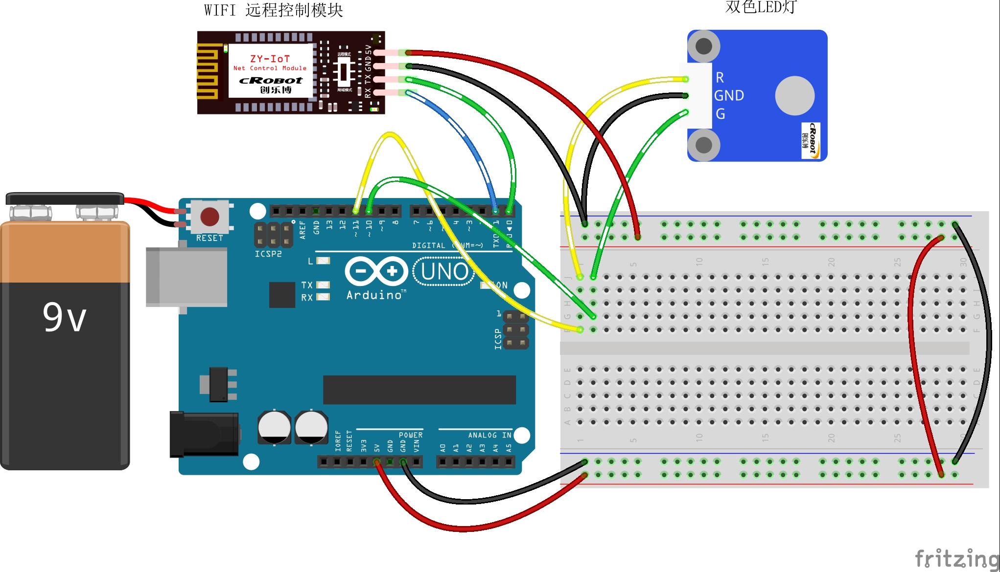

# 1-Remote-Control-LED

远程控制 LED

## 接线图



## 代码

```c
//定义引脚
int RED_LED_Pin = 11;    //红色LED
int GREEN_LED_Pin = 10;  //绿色LED

int incomingByte = 0;             // 接收到的 data byte
String inputString = "";          // 用来储存接收到的内容
boolean newLineReceived = false;  // 前一次数据结束标志
boolean startBit = false;         //协议开始标志
int tep = 0;

String returntemp = "";  //存储返回值

/**
* Function       setup
* @brief         初始化配置
*/

void setup() {
  //初始化LEDIO口为输出方式
  pinMode(RED_LED_Pin, OUTPUT);
  pinMode(GREEN_LED_Pin, OUTPUT);

  Serial.begin(9600);  //波特率9600 （Wifi通讯设定波特率）
  inputString.reserve(35);

  //LED初始化低电平
  digitalWrite(RED_LED_Pin, LOW);
  digitalWrite(GREEN_LED_Pin, LOW);
}

/**
* Function       loop
* @brief         按照接收的数据根据协议完成相应的功能 
*/
void loop() {
  //$LED-S11-S21-S30-L1100-L2050-L3000^
  while (newLineReceived) {
    if (inputString.indexOf("LED") == -1)  //如果要检索的字符串值“LED”没有出现
    {
      returntemp = "$LED-2,#";   //返回不匹配
      Serial.print(returntemp);  //返回协议数据包
      inputString = "";          // clear the string
      newLineReceived = false;
      break;
    }
    //        Serial.println(inputString[7]);
    if (inputString[7] == '1')  //RED
    {
      int i = inputString.indexOf("L1");     //从接收到的数据中检索字符串“L1”出现的位置
      int ii = inputString.indexOf("-", i);  //从接收到的数据中以i为起始位置检索字符串“-”的位置
      if (ii > i && ii > 0 && i > 0)         //如果ii和i的顺序对了并且检索到ii与i存在
      {
        String sRedPWM = inputString.substring(i + 2, ii);  //提取字符串中介于指定下标i+2到ii之间的字符赋值给sRedPWM
        Serial.println(sRedPWM);
        int iRedPWM = sRedPWM.toInt();                   //将字符串sRedPWM转为整型
        int outputValue = map(iRedPWM, 0, 100, 0, 255);  //遍历，定义outputValue等于iRedPWM按2.55的比例扩大的值
        analogWrite(RED_LED_Pin, outputValue);           //红灯亮
      } else                                             //如果检索到ii和i的顺序不对或者没有检索到ii或者i
      {
        returntemp = "$LED-1,#";   //返回匹配失败
        Serial.print(returntemp);  //返回协议数据包
        inputString = "";          // clear the string
        newLineReceived = false;
        break;
      }
    } else {
      analogWrite(RED_LED_Pin, 0);  //红灯灭
    }
    Serial.println(inputString[11]);
    if (inputString[11] == '1')  //Green
    {
      int i = inputString.indexOf("L2");     //从接收到的数据中检索字符串“L2”出现的位置
      int ii = inputString.indexOf("-", i);  //从接收到的数据中以i为起始位置检索字符串“，”的位置
      if (ii > i && ii > 0 && i > 0)         //如果ii和i的顺序对了并且检索到ii与i存在
      {
        String sGreenPWM = inputString.substring(i + 2, ii);  //提取字符串中介于指定下标i+2到ii之间的字符赋值给sGreenPWM
        Serial.println(sGreenPWM);
        int iGreenPWM = sGreenPWM.toInt();                 //将字符串sGreenPWM转为整型
        int outputValue = map(iGreenPWM, 0, 100, 0, 255);  //遍历，定义outputValue等于iGreenPWM按2.55的比例扩大的值
        analogWrite(GREEN_LED_Pin, outputValue);
      } else  //如果检索到ii和i的顺序不对或者没有检索到ii或者i
      {
        returntemp = "$LED-1,#";   //返回匹配失败
        Serial.print(returntemp);  //返回协议数据包
        inputString = "";          // clear the string
        newLineReceived = false;
        break;
      }
    } else {
      analogWrite(GREEN_LED_Pin, 0);  //control);
    }

    //       returntemp = "$LED-0,#";    //返回匹配成功
    //       Serial.print(returntemp); //返回协议数据包
    inputString = "";
    newLineReceived = false;
  }
}
/**
* Function       serialEvent
* @brief         串口接收中断 
*/
void serialEvent() {
  while (Serial.available())  //如果串口接收到数据则进入循环
  {
    incomingByte = Serial.read();  //一个字节一个字节地读，下一句是读到的放入字符串数组中组成一个完成的数据包
    if (incomingByte == '$')       //如果到来的字节是'$'，开始读取
    {
      startBit = true;
    }
    if (startBit == true) {
      inputString += (char)incomingByte;  // 全双工串口可以不用在下面加延时，半双工则要加的//
    }
    if (incomingByte == '^')  //如果到来的字节是'#'，读取结束
    {
      newLineReceived = true;
      startBit = false;
    }
  }
}

```