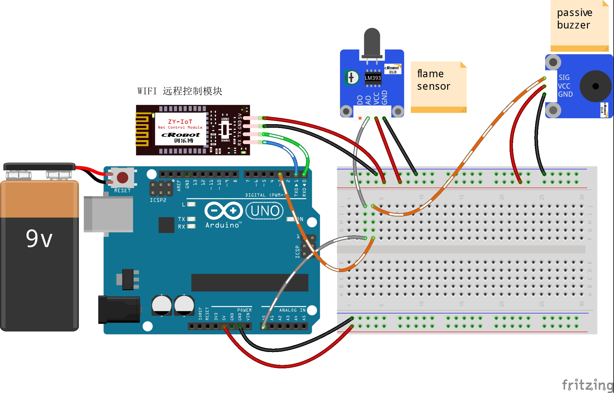

# 11-Remote-Flame-Alarm

远程火焰报警

## 接线图



## 代码

```c
#define FIRE_Pin A0  // 火焰传感器管脚，电压值0-1024
#define LED_Pin 3    // 报警指示灯管脚


int incomingByte = 0;             // 接收到的 data byte
String inputString = "";          // 用来储存接收到的内容
boolean newLineReceived = false;  // 前一次数据结束标志
boolean startBit = false;         //协议开始标志
int flag = 0;


String returntemp = "";  //存储返回值
int g_FIRE = 0;
int g_FIREThreshold = 50;

/*printf格式化字符串初始化*/
int serial_putc(char c, struct __file*) {
  Serial.write(c);
  return c;
}
void printf_begin(void) {
  fdevopen(&serial_putc, 0);
}
/**
* Function       setup
* @brief         初始化配置
*/
void setup() {
  pinMode(LED_Pin, OUTPUT);  //初始化LED IO口为输出方式
  Serial.begin(9600);        //波特率9600 （WIFI通讯设定波特率）
  printf_begin();            //初始化printf
}
/**
* Function       loop
* @brief         根据收到的协议设置火焰报警大小并决定是否报警，最后返回数据协议包
*/
void loop() {
  int val = analogRead(FIRE_Pin);  //读取A0口的电压值并赋值到val

  g_FIRE = map(val, 0, 1024, 0, 100);  //0-1024 划分到 0-100
  if (g_FIRE > g_FIREThreshold)        //如果检测到的火焰大小值大于收到微信界面发送时设定的火焰大小值
  {
    digitalWrite(LED_Pin, HIGH);  //蜂鸣器不叫
                                  //printf("$FIRE-0-0-%d#",X);  //打印当前火焰大小值
    Serial.print("$FIRE-0-0-X#");
  } else  //检测到的火焰大小值小于收到微信界面发送时设定的火焰大小值
  {
    digitalWrite(LED_Pin, LOW);  //蜂鸣器叫
    Serial.print("$FIRE-1-1-X#");
    // printf("$FIRE-1-1-%d#",X);  //打印当前火焰大小值
  }
  while (newLineReceived) {
    //Serial.println(inputString);
    if (inputString.indexOf("FIRE") == -1)  //如果要检索的字符串值“FIRE”没有出现
    {
      returntemp = "$FIRE-2-#";  //返回不匹配
      Serial.print(returntemp);  //返回协议数据包
      inputString = "";          // clear the string
      newLineReceived = false;   // 前一次数据结束标志
      break;
    }
    //$FIRE-X-X-0^
    int i = inputString.indexOf("^", 10);  //从接收到的数据中以第8位为起始位置检索字符串“-”的位置
                                           //  Serial.println(i);
    if (i > 0)                             //如果检索到了
    {
      String temp = inputString.substring(10, i);  //提取字符串中介于指定下标9到i之间的字符赋值给temp
      flag = temp.toInt();                         //将字符串temp转为整型赋值给g_GSThreshold
      //  Serial.println(temp);
    }

    if (flag == 0)  //如果检测到的火焰大小值大于收到微信界面发送时设定的火焰大小值
    {
      digitalWrite(LED_Pin, LOW);  //LED亮（报警）
      Serial.print("$FIRE-X-X-0#");
      //printf("$FIRE-X-X-%d#",g_FIRE);  //打印当前火焰值
    } else  //检测到的火焰大小值小于收到微信界面发送时设定的火焰大小值
    {
      digitalWrite(LED_Pin, HIGH);  //LED灭
                                    //  printf("$FIRE-X-X-%d#",g_FIRE);  //打印当前火焰大小值
      Serial.print("$FIRE-X-X-1#");
    }

    inputString = "";  // clear the string
    newLineReceived = false;
  }
  delay(2000);
}
/**
* Function       serialEvent
* @brief         串口接收中断
*/
void serialEvent() {
  while (Serial.available())  //如果串口接收到数据则进入循环
  {
    incomingByte = Serial.read();  //一个字节一个字节地读，下一句是读到的放入字符串数组中组成一个完成的数据包
    if (incomingByte == '$')       //如果到来的字节是'$'，开始读取
    {
      startBit = true;
    }
    if (startBit == true) {
      inputString += (char)incomingByte;  // 全双工串口可以不用在下面加延时，半双工则要加的//
    }
    if (incomingByte == '^')  //如果到来的字节是'^'，读取结束
    {
      newLineReceived = true;
      startBit = false;
    }
  }
}
```