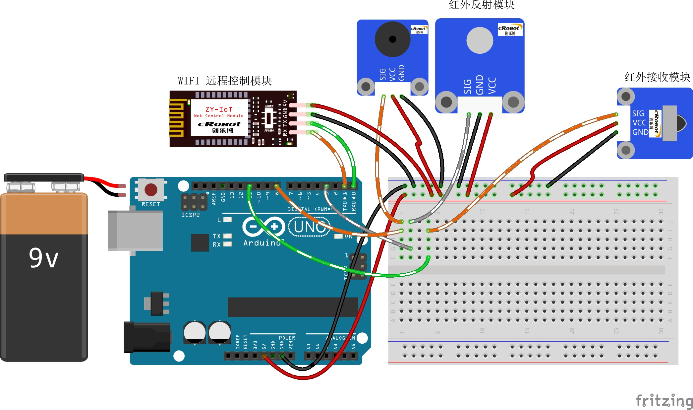

# Remote-infrared-control-of-home-appliances

远程红外控制家电

## 接线图



## 代码

```c
#include <IRremote.h>  //包含红外库
//#include <MsTimer2.h>               //定时器库的 头文件

#define RECV_PIN 11  // 接收引脚
#define LED_PIN 3    // 发射引脚
#define BEEP_PIN 8

int incomingByte = 0;             // 接收到的 data byte
String inputString = "";          // 用来储存接收到的内容
boolean newLineReceived = false;  // 前一次数据结束标志
boolean startBit = false;         //协议开始标志


String returntemp = "";  //存储返回值

long IRcode[9] = { 0 };
int on = 0;
unsigned long last = millis();
IRrecv irrecv(RECV_PIN);
decode_results results;  //结构声明

IRsend irsend;


int g_BtnNum = 0;
boolean g_IRStudyMode = false;  //学习模式的开关

unsigned int Key[250] = { 0 };  //由于有些编码太长大概243;其中多余2个存储这包数据长。UNO最大内存2Kb,故暂时只能存储2个按钮的学习
//unsigned int  rawCodes_ac_open[200] = {4397,4368,561,1578,560,537,557,1581,584,1582,584,486,558,537,584,1554,560,538,558,510,558,1607,557,513,585,511,556,1585,581,1583,583,486,557,1609,556,513,
//558,538,557,512,558,1607,558,1583,557,1608,558,1608,557,1580,559,1606,559,1581,556,1609,557,512,559,537,558,512,557,539,557,512,558,1607,558,1582,558,537,584,1555,558,1607,556,514,559,537,556,
//513,558,537,556,514,558,1606,559,511,583,513,558,1582,557,1608,558,1580,585,5154,4419,4347,584,1555,558,539,557,1581,584,1581,571,501,577,516,571,1568,557,541,581,487,557,1608,557,513,558,538,
//557,1582,583,1582,584,487,557,1608,557,511,611,486,558,510,558,1607,557,1609,556,1583,583,1582,583,1555,558,1607,558,1607,559,1582,557,537,585,486,558,510,558,540,558,509,557,1608,558,1608,557,
//512,559,1606,559,1581,558,537,581,490,558,510,587,511,557,511,559,1606,559,510,569,527,558,1582,560,1604,561,1605,561};
/*发送脉冲红外遥控码*/
// Test raw send or receive.  This is similar to the test method,
// except it send/receives raw data.
void testRaw(char *label, unsigned int *rawbuf, int rawlen) {

  irsend.sendRaw(rawbuf, rawlen, 38 /* kHz */);
  digitalWrite(BEEP_PIN, LOW);
  delay(200);
  digitalWrite(BEEP_PIN, HIGH);
  delay(200);
  digitalWrite(BEEP_PIN, LOW);
  delay(200);
  digitalWrite(BEEP_PIN, HIGH);
  delay(2000);
}


void dump(decode_results *results) {
  int count = results->rawlen;
  g_IRStudyMode = false;  //非学习模式
  memset(Key, 0x00, sizeof(Key));
  Key[0] = count - 1;  //
  //Serial.print("Start:");
  //Serial.print(Key[0]);
  //Serial.print(" ");
  for (int i = 1; i < count; i++) {
    Key[i] = results->rawbuf[i] * USECPERTICK;
    //Serial.print(Key[i]);
    //Serial.print(" ");
  }
}

void StudyMode() {
  if (irrecv.decode(&results))  //调用库函数：解码
  {
    // If it's been at least 1/4 second since the last
    // IR received, toggle the
    Serial.print("aaaa");

    if (millis() - last > 250) {
      on = !on;
      digitalWrite(13, on ? HIGH : LOW);
      dump(&results);
      digitalWrite(BEEP_PIN, LOW);
      delay(500);
      digitalWrite(BEEP_PIN, HIGH);
    }
    last = millis();
    irrecv.resume();  // Receive the next value
  }
}


//初始化
void setup() {
  pinMode(RECV_PIN, INPUT);  //端口模式，输入
  pinMode(13, OUTPUT);       //端口模式，输出
  pinMode(BEEP_PIN, OUTPUT);
  digitalWrite(BEEP_PIN, HIGH);
  Serial.begin(9600);  //波特率9600 （WIFI通讯设定波特率）

  irrecv.enableIRIn();  // Start the receiver
}

/*程序主循环入口*/
void loop() {
  if (g_IRStudyMode == true) {
    StudyMode();
  }
  while (newLineReceived) {
    //$IR-1-2^
    if (inputString.indexOf("IR") == -1) {
      returntemp = "$IR-2#";
      Serial.print(returntemp);  //返回协议数据包
      inputString = "";          // clear the string
      newLineReceived = false;
      break;
    }
    //控制模式
    if (inputString[4] == '0') {
      g_IRStudyMode = false;
      int i = inputString[6] - 0x30;  //字符转为数字
      testRaw("RAW1", Key + 1, Key[0]);
    }
    //学习模式
    else {
      g_BtnNum = inputString[6] - 0x30;
      g_IRStudyMode = true;
      irrecv.enableIRIn();
    }
    returntemp = "$IR-0#";
    Serial.print(returntemp);  //返回协议数据包
    inputString = "";          // clear the string
    newLineReceived = false;
  }
}

//serialEvent()是IDE1.0及以后版本新增的功能，不清楚为什么大部份人不愿意用，这个可是相当于中断功能一样的啊!
void serialEvent() {
  while (Serial.available()) {
    incomingByte = Serial.read();  //一个字节一个字节地读，下一句是读到的放入字符串数组中组成一个完成的数据包
    if (incomingByte == '$') {
      startBit = true;
    }
    if (startBit == true) {
      inputString += (char)incomingByte;  // 全双工串口可以不用在下面加延时，半双工则要加的//
    }
    if (incomingByte == '^') {
      newLineReceived = true;
      startBit = false;
    }
  }
}

```