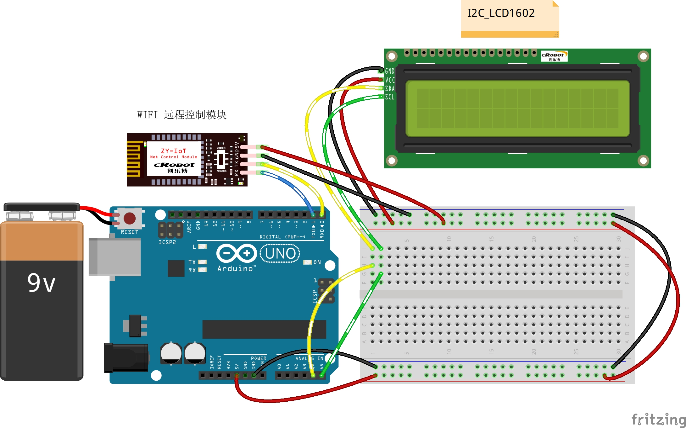

# 13-Remote-liquid-crystal-display

远程液晶显示

## 接线图



## 代码

```c
#include <Wire.h>
#include <LiquidCrystal_I2C.h>
LiquidCrystal_I2C lcd(0x27, 16, 2);  // set the LCD address to 0x27 for a 16 chars and 2 line display

int incomingByte = 0;             // 接收到的 data byte
String inputString = "";          // 用来储存接收到的内容
boolean newLineReceived = false;  // 前一次数据结束标志
boolean startBit = false;         //协议开始标志
int flag = 0;

String returntemp = "";  //存储返回值

/**
* Function       setup
* @brief         初始化配置
*/
void setup() {
  //初始化LEDIO口为输出方式
  lcd.init();          //initialize the lcd
  lcd.backlight();     //open the backlight
  Serial.begin(9600);  //波特率9600 （Wifi通讯设定波特率）
}

/**
* Function       loop
* @brief         按照接收的数据根据协议完成相应的功能 
*/
void loop() {
  while (newLineReceived) {
    Serial.println(inputString);
    if (inputString.indexOf("OLED") == -1)  //如果要检索的字符串值“OLED”没有出现
    {
      returntemp = "$OLED-1#";   //返回不匹配
      Serial.print(returntemp);  //返回协议数据包
      inputString = "";          // clear the string
      newLineReceived = false;
      break;
    }
    int i = inputString.indexOf("-", 6);  //从接收到的数据中以第8位为起始位置检索字符串“-”的位置
                                          // Serial.println(i);
    if (i > 0)                            //如果检索到了
    {
      String temp = inputString.substring(6, i);  //提取字符串中介于指定下标9到i之间的字符赋值给temp
      lcd.setCursor(0, 0);                        // set the cursor to column 15, line 0
      lcd.print(temp);
      delay(250);
    }
    int x = inputString.indexOf("^", 6);  //从接收到的数据中以第8位为起始位置检索字符串“-”的位置
    int y = inputString.indexOf("-", 6);  //从接收到的数据中以第8位为起始位置检索字符串“-”的位置
    if (y > 0)                            //如果检索到了
    {
      String temp1 = inputString.substring(y + 1, x - 2);  //提取字符串中介于指定下标9到i之间的字符赋值给temp1
      lcd.setCursor(0, 1);                                 // set the cursor to column 15, line 0
      lcd.print(temp1);
      delay(250);
      //Serial.println(temp1);
    }
    returntemp = "$OLED-0#";   //返回匹配成功
    Serial.print(returntemp);  //返回协议数据包
    inputString = "";
    newLineReceived = false;
  }
}
/**
* Function       serialEvent
* @brief         串口接收中断
*/
void serialEvent() {
  while (Serial.available())  //如果串口接收到数据则进入循环
  {
    incomingByte = Serial.read();  //一个字节一个字节地读，下一句是读到的放入字符串数组中组成一个完成的数据包
    if (incomingByte == '$')       //如果到来的字节是'$'，开始读取
    {
      startBit = true;
    }
    if (startBit == true) {
      inputString += (char)incomingByte;  // 全双工串口可以不用在下面加延时，半双工则要加的//
    }
    if (incomingByte == '^')  //如果到来的字节是'#'，读取结束
    {
      newLineReceived = true;
      startBit = false;
    }
  }
}

```