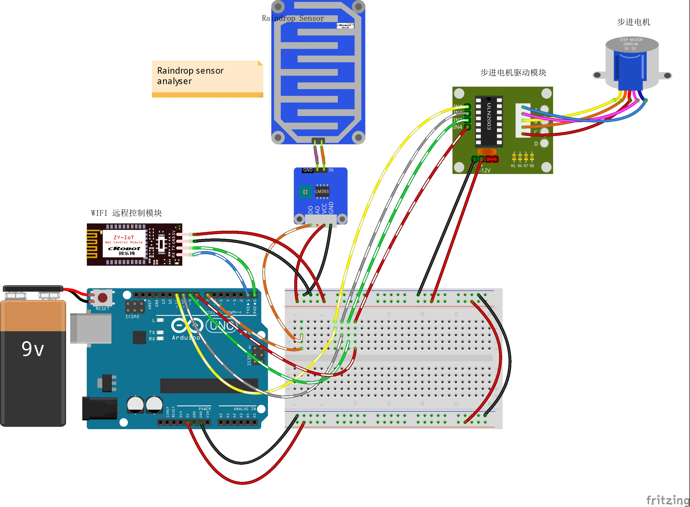

# 14-Remote-raindrop-detection-and-switch-window-control

远程雨滴检测与开关窗控制

## 接线图



## 代码

```c
#define Rain_Pin 7  // 雨滴传感器管脚,低电平，有雨滴
#define LED_Pin 13  // LED管脚

const int IN1 = 11;
const int IN2 = 10;
const int IN3 = 9;
const int IN4 = 8;

const char tab1[] = {
  0x01, 0x03, 0x02, 0x06, 0x04, 0x0c, 0x08, 0x09
};
const char tab2[] = {
  0x01, 0x09, 0x08, 0x0c, 0x04, 0x06, 0x02, 0x03
};

int incomingByte = 0;             // 接收到的 data byte
String inputString = "";          // 用来储存接收到的内容
boolean newLineReceived = false;  // 前一次数据结束标志
boolean startBit = false;         //协议开始标志
boolean CHUANG_flag = false;      //0表示关窗 1-表示开窗
int flag = 0;

String returntemp = "";  //存储返回值
int g_Rain = 0;
int g_RainThreshold = 50;

/*printf格式化字符串初始化*/
int serial_putc(char c, struct __file*) {
  Serial.write(c);
  return c;
}
void printf_begin(void) {
  fdevopen(&serial_putc, 0);
}
/**
* Function       setup
* @brief         初始化配置
*/
void setup() {
  //-------------------步进电机控制管脚-------------
  pinMode(IN1, OUTPUT);
  pinMode(IN2, OUTPUT);
  pinMode(IN3, OUTPUT);
  pinMode(IN4, OUTPUT);
  //------------------------------------------------
  //---------雨滴传感器接收端口-------------------
  pinMode(Rain_Pin, INPUT);  //输入管脚
                             //---------------------------------------------
  pinMode(LED_Pin, OUTPUT);
  digitalWrite(LED_Pin, LOW);

  Serial.begin(9600);  //波特率9600 （WIFI通讯设定波特率）
  printf_begin();      //初始化printf
}

void ctlStepMotor(int angle, char speeds) {
  for (int j = 0; j < abs(angle); j++) {
    if (angle > 0) {
      for (int i = 0; i < 8; i++) {
        digitalWrite(IN1, ((tab1[i] & 0x01) == 0x01 ? true : false));
        digitalWrite(IN2, ((tab1[i] & 0x02) == 0x02 ? true : false));
        digitalWrite(IN3, ((tab1[i] & 0x04) == 0x04 ? true : false));
        digitalWrite(IN4, ((tab1[i] & 0x08) == 0x08 ? true : false));
        delay(speeds);
      }
    } else {
      for (int i = 0; i < 8; i++) {
        digitalWrite(IN1, ((tab2[i] & 0x01) == 0x01 ? true : false));
        digitalWrite(IN2, ((tab2[i] & 0x02) == 0x02 ? true : false));
        digitalWrite(IN3, ((tab2[i] & 0x04) == 0x04 ? true : false));
        digitalWrite(IN4, ((tab2[i] & 0x08) == 0x08 ? true : false));
        delay(speeds);
      }
    }
  }
}
void StepMotorStop() {
  digitalWrite(IN1, 0);
  digitalWrite(IN2, 0);
  digitalWrite(IN3, 0);
  digitalWrite(IN4, 0);
}
/**
* Function       loop
* @brief         根据收到的协议设置火焰报警大小并决定是否报警，最后返回数据协议包
*/
void loop() {
  g_Rain = digitalRead(Rain_Pin);  //读取雨滴传感器数值
  if (g_Rain == 0)                 //检测到雨滴
  {
    digitalWrite(LED_Pin, HIGH);   //LED点亮
    Serial.print("$RAIN-0-X-0#");  //关窗
    if (CHUANG_flag == true)       //如果为开窗状态
    {
      //开启关窗动作
      ctlStepMotor(360, 1);
      StepMotorStop();
      CHUANG_flag = false;  //关窗完成
    }
  } else  //没有检测到雨滴
  {
    digitalWrite(LED_Pin, LOW);  //LED不亮
    Serial.print("$RAIN-0-X-1#");
    if (CHUANG_flag == false)  //如果为关窗状态
    {
      //开启开窗动作
      ctlStepMotor(-360, 1);
      StepMotorStop();
      CHUANG_flag = true;  //开窗完成
    }
  }
  while (newLineReceived) {
    //        Serial.println(inputString);
    if (inputString.indexOf("RAIN") == -1)  //如果要检索的字符串值“FIRE”没有出现
    {
      returntemp = "$RAIN-2#";   //返回不匹配
      Serial.print(returntemp);  //返回协议数据包
      inputString = "";          // clear the string
      newLineReceived = false;   // 前一次数据结束标志
      break;
    }
    // $RAIN-2-X-X^
    int i = inputString.indexOf("^", 7);  //从接收到的数据中以第8位为起始位置检索字符串“-”的位置

    if (i > 0)  //如果检索到了
    {
      String temp = inputString.substring(6);  //提取字符串中介于指定下标9到i之间的字符赋值给temp
      flag = temp.toInt();                     //将字符串temp转为整型赋值给g_GSThreshold
                                               // Serial.println(flag);
      if (flag == 2)                           //开窗
      {
        digitalWrite(LED_Pin, LOW);  //LED不亮
        Serial.print("$RAIN-0-1-1#");
        if (CHUANG_flag == false)  //如果为关窗状态
        {
          //开启开窗动作
          ctlStepMotor(-360, 1);
          StepMotorStop();
          CHUANG_flag = true;  //开窗完成
        }
      } else if (flag == 3)  //关窗
      {
        digitalWrite(LED_Pin, HIGH);   //LED点亮
        Serial.print("$RAIN-0-1-0#");  //关窗
        if (CHUANG_flag == true)       //如果为开窗状态
        {
          //开启关窗动作
          ctlStepMotor(360, 1);
          StepMotorStop();
          CHUANG_flag = false;  //关窗完成
        }
      }
    }
    inputString = "";  // clear the string
    newLineReceived = false;
  }
  delay(2000);
}
/**
* Function       serialEvent
* @brief         串口接收中断
*/
void serialEvent() {
  while (Serial.available())  //如果串口接收到数据则进入循环
  {
    incomingByte = Serial.read();  //一个字节一个字节地读，下一句是读到的放入字符串数组中组成一个完成的数据包
    if (incomingByte == '$')       //如果到来的字节是'$'，开始读取
    {
      startBit = true;
    }
    if (startBit == true) {
      inputString += (char)incomingByte;  // 全双工串口可以不用在下面加延时，半双工则要加的//
    }
    if (incomingByte == '^')  //如果到来的字节是'^'，读取结束
    {
      newLineReceived = true;
      startBit = false;
    }
  }
}
```