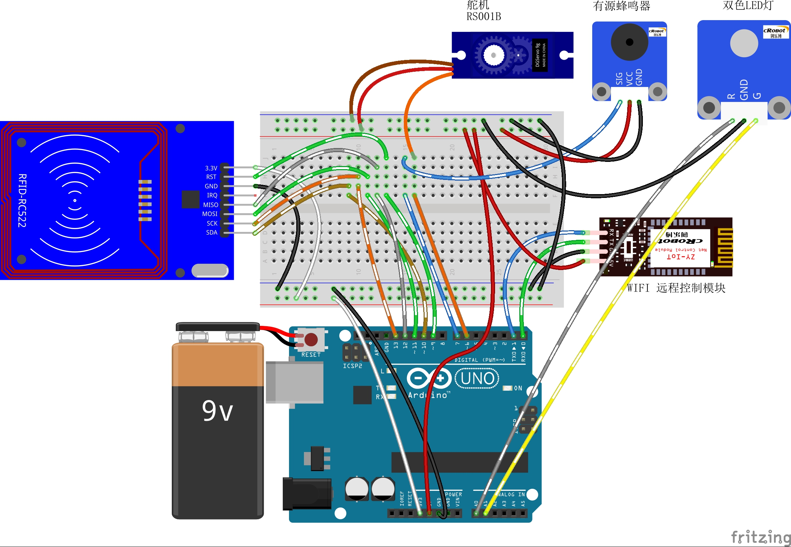

# 15-Remote-RFID-monitoring

远程RFID监控

## 接线图



## 代码

```c
#include <SPI.h>      //RFID库文件
#include <MFRC522.h>  //RFID库文件
#include <Servo.h>    //Arduino IDE自带的舵机库文件

/*需要修改的地方, 这里卡号改成你读取到，并赋值你想要的名字, 也可以增加多张卡,根据单片机的容量而定*/
String CardInfo[4][2] = {
  { "07531b26", "tom" },
  { "8f3d0329", "jeiker" },
  { "ab8058a3", "xiao" },
  { "a075f1a2", "john" },
};
int MaxNum = 4;  //这里存储最大的卡信息数与上面数组保持一致.


#define Servo_Pin 6   //模拟开门
#define Beep_Pin 7    //蜂鸣器成功提示
#define LED_RED A0    //红灯
#define LED_Green A1  //绿灯

#define RST_PIN 9  // RFID 的RST引脚
#define SS_PIN 10  // RFID 的SDA(SS)引脚

MFRC522 mfrc522(SS_PIN, RST_PIN);  // Create MFRC522 instance.

MFRC522::MIFARE_Key key;

Servo myservo;                  //定义舵机对象myservo
boolean g_boolSuccess = false;  //刷卡成功标识
/*通信协议*/
int incomingByte = 0;             // 接收到的 data byte
String inputString = "";          // 用来储存接收到的内容
boolean newLineReceived = false;  // 前一次数据结束标志
boolean startBit = false;         //协议开始标志
String returntemp = "";           //存储返回值

/**
* Function       Beep_Success
* @brief         刷卡成功铃声 
*/
void Beep_Success()  //刷卡成功铃声
{
  for (int i = 0; i < 3; i++)  //鸣叫三次
  {
    digitalWrite(Beep_Pin, LOW);   //打开蜂鸣器
    delay(100);                    //延时100
    digitalWrite(Beep_Pin, HIGH);  //关闭蜂鸣器
    delay(100);                    //延时100
  }
}
/**
* Function       Beep_Fail
* @brief         刷卡失败铃声 
*/
void Beep_Fail()  //刷卡失败铃声
{

  digitalWrite(Beep_Pin, LOW);   //打开蜂鸣器
  delay(1500);                   //延时1500
  digitalWrite(Beep_Pin, HIGH);  //关闭蜂鸣器
}
/**
* Function       setup
* @brief         初始化配置
*/
void setup() {
  Serial.begin(9600);          //波特率9600 （Wifi通讯设定波特率）
  pinMode(Servo_Pin, OUTPUT);  //初始化舵机为输出模式
  pinMode(Beep_Pin, OUTPUT);   //初始化蜂鸣器为输出模式
  pinMode(LED_RED, OUTPUT);    //初始化LED为输出模式
  pinMode(LED_Green, OUTPUT);  //初始化LED为输出模式

  while (!Serial)
    ;                            //如果没有打开串行端口，就什么也不做(添加基于ATMEGA32U4的Arduinos)
  SPI.begin();                   //初始化SPI
  mfrc522.PCD_Init();            //初始化 MFRC522
  myservo.attach(Servo_Pin);     //设置舵机控制引脚为3
  myservo.write(0);              //初始化舵机位置0
  digitalWrite(Beep_Pin, HIGH);  //关闭蜂鸣器
  digitalWrite(LED_RED, HIGH);   //打开红LED
  digitalWrite(LED_Green, LOW);  //关闭绿LED
}

/**
* Function       loop
* @brief         按照接收的数据根据协议完成开门
*/
void loop() {
  while (newLineReceived) {
    //  Serial.println(inputString); //返回协议数据包
    if (inputString.indexOf("RFID") == -1)  //如果要检索的字符串值“RFID”没有出现
    {
      returntemp = "$RFID-2#";   //返回不匹配
      Serial.print(returntemp);  //返回协议数据包
      inputString = "";          // clear the string
      newLineReceived = false;
      break;
    }

    if (inputString[12] == '1')  //远程开门
    {
      digitalWrite(LED_RED, LOW);     //关闭红LED
      digitalWrite(LED_Green, HIGH);  //打开绿LED
      Beep_Success();                 //刷卡成功铃声
      myservo.write(90);              //舵机旋转至90度
      delay(3000);                    //延时3000
      myservo.write(0);               //舵机旋转至90度
      digitalWrite(LED_RED, HIGH);    //打开红LED
      digitalWrite(LED_Green, LOW);   //关闭绿LED
    }
    if (inputString[12] == '2')  //远程关门
    {
      digitalWrite(LED_RED, LOW);     //关闭红LED
      digitalWrite(LED_Green, HIGH);  //打开绿LED
      Beep_Success();                 //刷卡成功铃声
      myservo.write(0);               //舵机旋转至0度
      delay(3000);                    //延时3000
      myservo.write(90);              //舵机旋转至90度
      digitalWrite(LED_RED, HIGH);    //打开红LED
      digitalWrite(LED_Green, LOW);   //关闭绿LED
    }
    //  returntemp = "$RFID-0#";  //返回匹配成功
    //    Serial.print(returntemp); //返回协议数据包
    inputString = "";  // clear the string
    newLineReceived = false;
  }
  /* 寻找新的卡片*/
  if (!mfrc522.PICC_IsNewCardPresent())
    return;
  /* 选择一张卡片*/
  if (!mfrc522.PICC_ReadCardSerial())
    return;
  /* 显示PICC的信息，将卡的信息写入temp */
  String temp, str;  //定义字符串temp,str
  for (byte i = 0; i < mfrc522.uid.size; i++) {
    str = String(mfrc522.uid.uidByte[i], HEX);  // 将数据转换成16进制的字符
    if (str.length() == 1)                      //保证str的长度有两位
    {
      str = "0" + str;
    }
    temp += str;  //将字符str放入temp
  }
  //   Serial.print("Card:" + temp + "\n");  //这里打开可以查看实际的卡，方便填写数组
  /* 将temp的信息与存储的卡信息库CardInfo[4][2]进行比对*/
  for (int i = 0; i < MaxNum; i++) {
    if (CardInfo[i][0] == temp)  //如果在CardInfo[i][0]中比对到卡片的信息
    {
      //Serial.print(CardInfo[i][1] + " Open door!\n");
      Serial.print("$RFID-" + CardInfo[i][0] + "-" + CardInfo[i][1] + "-1-0#");  //将卡的信息打印到串口
      g_boolSuccess = true;                                                      //刷卡成功标识
    }
  }
  if (g_boolSuccess == true)  //如果刷卡成功
  {
    digitalWrite(LED_RED, LOW);     //红灯灭
    digitalWrite(LED_Green, HIGH);  //绿灯亮
    Beep_Success();                 //刷卡成功铃声
    myservo.write(90);              //舵机旋转至90度
    delay(3000);                    // 延时3000ms
    myservo.write(0);               //舵机旋转至0度
  } else                            //刷卡失败
  {
    Beep_Fail();                 //刷卡失败铃声
    digitalWrite(LED_RED, LOW);  //红灯灭
  }
  digitalWrite(LED_RED, HIGH);   //红灯亮
  digitalWrite(LED_Green, LOW);  //绿灯灭
  g_boolSuccess = false;         //刷卡失败标识
  mfrc522.PICC_HaltA();          //停止读写
  mfrc522.PCD_StopCrypto1();     //停止向PCD加密
}

/**
* Function       serialEvent
* @brief         串口接收中断
*/
void serialEvent() {
  while (Serial.available())  //如果串口接收到数据则进入循环
  {
    incomingByte = Serial.read();  //一个字节一个字节地读，下一句是读到的放入字符串数组中组成一个完成的数据包
    if (incomingByte == '$')       //如果到来的字节是'$'，开始读取
    {
      startBit = true;
    }
    if (startBit == true) {
      inputString += (char)incomingByte;  // 全双工串口可以不用在下面加延时，半双工则要加的//
    }
    if (incomingByte == '^') {
      newLineReceived = true;  //如果到来的字节是'#'，读取结束
      startBit = false;
    }
  }
}

```