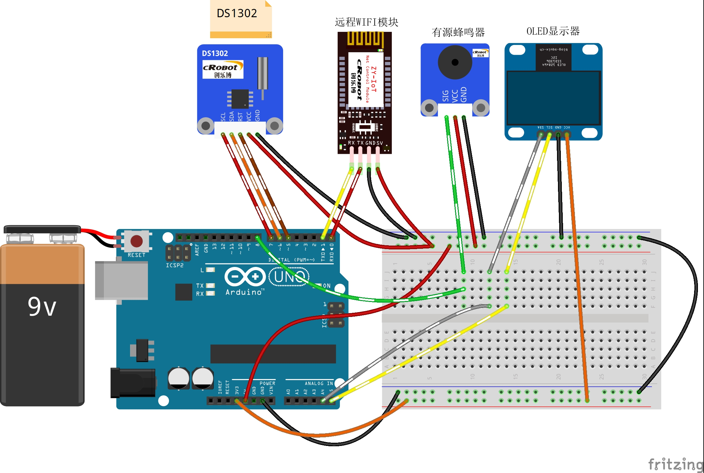

# 16-Remote-timer

远程定时闹钟

## 接线图



## 代码

```c
#include <DS1302.h>//申明DS1302的函数库
#include <Wire.h>//申明OLED 12864的函数库
#include <Adafruit_GFX.h>//申明OLED 12864的函数库
#include <Adafruit_SSD1306.h>//申明OLED 12864的函数库

#define OLED_RESET 8
Adafruit_SSD1306 display(OLED_RESET);

/* 接口定义
CE(DS1302 pin5) -> Arduino D5
IO(DS1302 pin6) -> Arduino D6
SCLK(DS1302 pin7) -> Arduino D7
*/
const uint8_t CE_PIN   = 5;
const uint8_t IO_PIN   = 6;
const uint8_t SCLK_PIN = 7;

/* 日期变量缓存 */
char day[10];
/* 串口数据缓存 */

int numdata[7] ={0};
/* 创建 DS1302 对象 */
DS1302 rtc(CE_PIN, IO_PIN, SCLK_PIN);
/*闹钟相关*/
const uint8_t SPEAKER_Pin= 8;
Time clock;

/*串口协议相关*/
int incomingByte = 0;       // 接收到的 data byte
String inputString = "";         // 用来储存接收到的内容
boolean newLineReceived = false; // 前一次数据结束标志
boolean startBit  = false;  //协议开始标志
String returntemp = ""; //存储返回值 
/**
* Function       display_time
* @brief         显示时间函数 
**/
void display_time()
{
    /* 从 DS1302 获取当前时间 */
    char  temp[30] = {0};
    Time t = rtc.time();
    int week;
    switch (t.day)
    {
      case 1:  week = 7; break;//如果DS1302计时中的t.day为1时是星期日
      case 2:  week = 1; break;//如果DS1302计时中的t.day为2时是星期一
      case 3:  week = 2; break;//如果DS1302计时中的t.day为3时是星期二
      case 4:  week = 3; break;//如果DS1302计时中的t.day为4时是星期三
      case 5:  week = 4; break;//如果DS1302计时中的t.day为5时是星期四
      case 6:  week = 5; break;//如果DS1302计时中的t.day为6时是星期五
      case 7:  week = 6; break;//如果DS1302计时中的t.day为7时是星期六
    }
    
    /* 将日期代码格式化凑成buf等待输出 */
    snprintf(temp, sizeof(temp), "%04d-%02d-%02d%02d:%02d:%02d", t.yr, t.mon, t.date, t.hr, t.min, t.sec);
    //snprintf(temp, sizeof(temp), "%04d-%02d-%02d%02d:%02d:%02d %d", t.yr, t.mon, t.date, t.hr, t.min, t.sec ,week);
    display.clearDisplay();   // 清屏    
    display.setTextSize(2);   //字体尺寸大小2
    display.setTextColor(WHITE);//字体颜色为白色
    display.setCursor(0,0); //把光标定位在第0行，第0列
    display.print("ChuangLeBo");//显示字符
    display.setCursor(0,16); //把光标定位在第16行，第0列
    display.print(temp);//显示时间
    display.setCursor(0,48); //把光标定位在第48行，第0列
    display.print(" Wellcom!"); //显示字符
    display.display();//显示   
}
/**
* Function       Play_Music
* @brief         闹钟铃声函数 
**/
void Play_Music()
{
  for(int x=0; x < 20;x++)
  {
     digitalWrite( SPEAKER_Pin, LOW); //蜂鸣器停 
     delay(100);   //延时100ms
     digitalWrite( SPEAKER_Pin, HIGH); //蜂鸣器响
     delay(100);   //延时100ms
     digitalWrite( SPEAKER_Pin, LOW);  //蜂鸣器停
     delay(100);   //延时100ms
     digitalWrite( SPEAKER_Pin, HIGH); //蜂鸣器响
     delay(100);   //延时100ms
     digitalWrite( SPEAKER_Pin, LOW);  //蜂鸣器停
     delay(100);   //延时100ms
     digitalWrite( SPEAKER_Pin, HIGH);//蜂鸣器响 
     delay(300);   //延时100ms   
  } 
}
/**
* Function       Deal_Clock
* @brief         闹钟 
**/
void Deal_Clock()
{
   /* 从 DS1302 获取当前时间 */
    Time t = rtc.time();
    if(t.yr != clock.yr)//如果此时的年份不等于闹钟定时的年份   
    {
      return;//返回主函数
    }
    if(t.mon != clock.mon)//如果此时的月份不等于闹钟定时的月份
    {
      return;//返回主函数
    }
    if(t.date != clock.date)//如果此时的日不等于闹钟定时的日
    {
      return;//返回主函数
    }
    if(t.hr != clock.hr)//如果此时的小时不等于闹钟定时的小时
    {
      return;//返回主函数
    }
    if(t.min != clock.min)//如果此时的分不等于闹钟定时的分
    {
      return;//返回主函数
    }
//    if(t.yr != clock.yr)//如果此时的年份不等于闹钟定时的年份
//    {
//      return;//返回主函数
//    }
//    if(t.day != clock.day)//如果此时的星期不等于闹钟定时的星期
//    {
//      return;//返回主函数
//    }
    if(t.sec != clock.sec)//如果此时的秒不等于闹钟定时的秒
    {
      return;
    }
    else //到达闹钟时间
    {
      display.clearDisplay();   // 清屏
      display.setTextSize(2);   //字体尺寸大小2   
      display.setTextColor(WHITE);//字体颜色为白色
      display.setCursor(0,0); //把光标定位在第0行，第0列
      display.print(" CLB Happy Birthday  To You!   ");//显示字符
      display.display();//显示     
      Play_Music();//闹铃
    }   
}
/**
* Function       setup
* @brief         初始化配置
**/
void setup()
{
     /* 初始化蜂鸣器为输出模式，输出为高电平 */
    pinMode( SPEAKER_Pin, OUTPUT); 
    digitalWrite( SPEAKER_Pin, HIGH); 
   
   /* 初始化WIFI通讯波特率为9600 */ 
    Serial.begin(9600);
    rtc.write_protect(true); //写保护开启
    rtc.halt(true);  //ds1302开始工作    
    
    display.begin(SSD1306_SWITCHCAPVCC, 0x3c);  // initialize with the I2C addr 0x3D (for the 128x64)

    display.clearDisplay();   // 清屏
    display.setTextSize(3);   //字体尺寸大小2
    display.setTextColor(WHITE);//字体颜色为白色
    display.setCursor(0,16); //把光标定位在第0行，第0列
    display.print("ChuangLeBo");//显示字符
    display.display();//显示
    delay(2000); //延时两秒
    
    display.clearDisplay();   // 清屏    
    display.setTextSize(2);   //字体尺寸大小2
    display.setTextColor(WHITE);//字体颜色为白色
    display.setCursor(0,0); //把光标定位在第0行，第0列
    display.print(" ChuangLeBo");//显示字符
    display.setCursor(0,16); //把光标定位在第0行，第0列
    display.print("2018-07-18");//显示时间年月日
    display.setCursor(0,32);   //把光标定位在第32行，第0列
    display.print("17:12:59 "); //显示时间时分秒
    display.setCursor(0,48); //把光标定位在第48行，第0列
    display.print(" Wellcom!"); //显示字符
    display.display();//显示   
}
/**
* Function       loop
* @brief         将协议的时间写入ds1302 
**/
void loop()
{
    while(newLineReceived == true)//前一次数据接收结束后进入循环
    {
       //  Serial.println(inputString); //串口打印数据包       
        //$CLK-0-2017-11-10-15-23-20-5^
         if(inputString.indexOf("CLK") == -1)//如果要检索的字符串值“CLK”没有出现
         {
            returntemp = "$CLK-2#";  //返回不匹配
            Serial.print(returntemp); //返回协议数据包       
            inputString = "";   // clear the string
            newLineReceived = false;
            break;    
         }         
         //-----------------------校准时间-------------------------
         if(inputString[5] == '0')
         {
            int j = 0;         
            for(int i = 7; i < 29  ; i++)//协议的长度是29，第七位是时间的位置
            {
                if(inputString[i] == '-' || inputString[i] == '^')//如果检测到的是‘-’或者是‘^’
                {
                    j++;
                }
                else//检测到的不是‘-’或者不是‘^’
                {
                    numdata[j] = numdata[j] * 10 + (inputString[i] - '0');//将年写入numdata[0]，月写入numdata[1]，日写入numdata[2]...秒写入numdata[6]，星期写入numdata[7]
                }
            }
            /* 将转换好的numdata凑成时间格式，写入DS1302 */
            rtc.write_protect(false);//关闭写保护
            rtc.halt(false);//DS1302停止工作
            Time t(numdata[0], numdata[1], numdata[2], numdata[3], numdata[4], numdata[5], numdata[6]);//将转换好的numdata凑成时间格式，写入DS1302
            rtc.time(t);    //获取当前时间
            rtc.write_protect(true);//打开写保护
            rtc.halt(true);//DS1302开始工作
            /* 清空 numdata */
            for(int i = 0; i < 7 ; i++) numdata[i]=0; 
         }
         else//设置闹钟  $CLK-1-2017-11-10-15-23-20-5#
         {
            int j = 0;
            for(int i = 7; i < 29  ; i++) //协议的长度是29，第七位是时间的位置
            {
                if(inputString[i] == '-' || inputString[i] == '^') //如果检测到的是‘，’或者是‘#’
                {
                    j++;
                }
                else//检测到的不是‘-’或者不是‘^’
                {
                    numdata[j] = numdata[j] * 10 + (inputString[i] - '0');//将年写入numdata[0]，月写入numdata[1]，日写入numdata[2]...秒写入numdata[6]，星期写入numdata[7]
                }
            }           
            clock.yr   = numdata[0];//将协议里的年份写入DS1202
            clock.mon  = numdata[1];//将协议里的月份写入DS1202
            clock.date = numdata[2];//将协议里的日写入DS1202
            clock.hr   = numdata[3];//将协议里的小时写入DS1202
            clock.min  = numdata[4];//将协议里的分写入DS1202
            clock.sec  = numdata[5];//将协议里的秒写入DS1202
            //clock.day =  numdata[6];//将协议里的星期写入DS1202
             /* 清空 numdata */
            for(int i = 0; i < 7 ; i++) numdata[i]=0;
         }
         returntemp = "$CLK-0#";//返回匹配成功     
         Serial.print(returntemp); //返回协议数据包       
         inputString = "";   // clear the string
         newLineReceived = false;          
    }  
   /* 打印当前时间 */
   //print_time();
    display_time();
    Deal_Clock();
    delay(1000);
}
/**
* Function       serialEvent
* @brief         串口接收中断
**/ 
void serialEvent()
{
  while (Serial.available())              //如果串口接收到数据则进入循环
  {    
    incomingByte = Serial.read();              //一个字节一个字节地读，下一句是读到的放入字符串数组中组成一个完成的数据包
    if(incomingByte == '$')                     //如果到来的字节是'$'，开始读取
    {
      startBit= true;
    }
    if(startBit == true)
    {
       inputString += (char) incomingByte;     // 全双工串口可以不用在下面加延时，半双工则要加的//
    }  
    if (incomingByte == '^')                   //如果到来的字节是'#'，读取结束
    {
       newLineReceived = true; 
       startBit = false;     
    }
  }
}
```