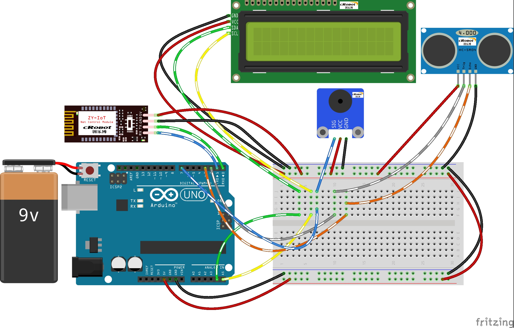

# 17-Remote-ultrasonic-ranging

远程超声波测距

## 接线图



## 代码

```c
#include <Wire.h>
#include <LiquidCrystal_I2C.h>
#include <NewPing.h>

LiquidCrystal_I2C lcd(0x27, 16, 2);  //0x27   0x3F

#define LED_Pin 7  // 报警指示灯管脚

#define TRIGGER_PIN 2                                // Arduino pin tied to trigger pin on the ultrasonic sensor.
#define ECHO_PIN 3                                   // Arduino pin tied to echo pin on the ultrasonic sensor.
#define MAX_DISTANCE 400                             // Maximum distance we want to ping for (in centimeters). Maximum sensor distance is rated at 400-500cm.
NewPing sonar(TRIGGER_PIN, ECHO_PIN, MAX_DISTANCE);  // NewPing setup of pins and maximum distance.

int incomingByte = 0;             // 接收到的 data byte
String inputString = "";          // 用来储存接收到的内容
boolean newLineReceived = false;  // 前一次数据结束标志
boolean startBit = false;         //协议开始标志


String returntemp = "";  //存储返回值
int g_UTL = 0;
int g_UTLThreshold = 103;

/*printf格式化字符串初始化*/
int serial_putc(char c, struct __file*) {
  Serial.write(c);
  return c;
}
void printf_begin(void) {
  fdevopen(&serial_putc, 0);
}
/**
* Function       setup
* @brief         初始化配置
*/
void setup() {
  pinMode(LED_Pin, OUTPUT);  //初始化LED IO口为输出方式
  digitalWrite(LED_Pin, HIGH);
  lcd.init();
  lcd.backlight();
  Serial.begin(9600);  //波特率9600 （WIFI通讯设定波特率）
  printf_begin();      //初始化printf
}
/**
* Function       loop
* @brief         根据收到的协议设置超声波报警距离并决定是否报警，最后返回数据协议包
*/

void loop() {
TP1:
  delay(100);
  unsigned int uS = sonar.ping();
  g_UTL = uS / US_ROUNDTRIP_CM;
  if (g_UTL == 0) goto TP1;  //误判

  lcd.setCursor(0, 0);
  lcd.print("Distance:");
  lcd.setCursor(0, 1);
  lcd.print("             ");
  lcd.setCursor(9, 1);
  lcd.print(g_UTL);
  lcd.setCursor(12, 1);
  lcd.print("cm");

  if (g_UTL < g_UTLThreshold)  //如果检测到的超声波距离值大于收到微信界面发送时设定的超声波距离值
  {
    digitalWrite(LED_Pin, LOW);  //LED亮
    printf("$UTL-%d-%d-1#", g_UTL, g_UTLThreshold);
  } else  //检测到的超声波距离值小于收到微信界面发送时设定的超声波距离值
  {
    digitalWrite(LED_Pin, HIGH);  //LED灭
    printf("$UTL-%d-%d-0#", g_UTL, g_UTLThreshold);
  }
  while (newLineReceived) {
    //    Serial.println(inputString);
    if (inputString.indexOf("UTL") == -1)  //如果要检索的字符串值“SMOKE”没有出现
    {
      returntemp = "$UTL-2#";    //返回不匹配
      Serial.print(returntemp);  //返回协议数据包
      inputString = "";          // clear the string
      newLineReceived = false;   // 前一次数据结束标志
      break;
    }
    //$UTL-XXX-123-X^
    int i = inputString.indexOf("-", 9);  //从接收到的数据中以第7位为起始位置检索字符串“，”的位置
    if (i > 0)                            //如果检索到了
    {
      String temp = inputString.substring(9, i);  //提取字符串中介于指定下标7到i之间的字符赋值给temp
      g_UTLThreshold = temp.toInt();              //将字符串temp转为整型赋值给g_GSThreshold
                                                  //   Serial.println(temp);
    }
    //      Serial.println(temp);
    if (g_UTL < g_UTLThreshold)  //如果检测到的超声波距离值大于收到微信界面发送时设定的超声波距离值
    {
      digitalWrite(LED_Pin, LOW);  //LED亮（报警）
      printf("$UTL-%d-%d-1#", g_UTL, g_UTLThreshold);
    } else  //检测到的超声波距离值小于收到微信界面发送时设定的超声波距离值
    {
      digitalWrite(LED_Pin, HIGH);  //LED灭(关闭报警)
      printf("$UTL-%d-%d-0#", g_UTL, g_UTLThreshold);
    }

    inputString = "";  // clear the string
    newLineReceived = false;
  }
  delay(2000);
}
/**
* Function       serialEvent
* @brief         串口接收中断
*/
void serialEvent() {
  while (Serial.available())  //如果串口接收到数据则进入循环
  {
    incomingByte = Serial.read();  //一个字节一个字节地读，下一句是读到的放入字符串数组中组成一个完成的数据包
    if (incomingByte == '$')       //如果到来的字节是'$'，开始读取
    {
      startBit = true;
    }
    if (startBit == true) {
      inputString += (char)incomingByte;  // 全双工串口可以不用在下面加延时，半双工则要加的//
    }
    if (incomingByte == '^')  //如果到来的字节是'^'，读取结束
    {
      newLineReceived = true;
      startBit = false;
    }
  }
}
```