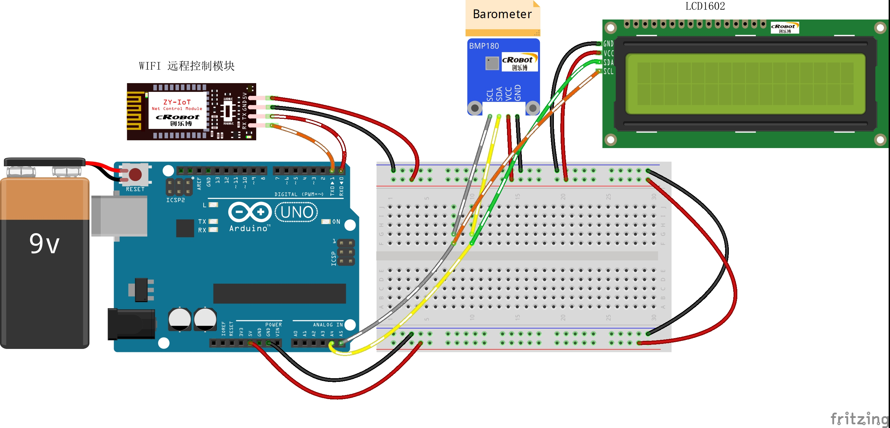

# Remote-pressure-detection-and-altitude-judgment

远程气压检测与海拔高度判断

## 接线图



## 代码

```c
#include <Wire.h>
#include <LiquidCrystal_I2C.h>
#include <SFE_BMP180.h>

LiquidCrystal_I2C lcd(0x27, 16, 2);  //0x27 and 0x3F
SFE_BMP180 pressure;

#define LED_Pin 7  // 报警指示灯管脚

int incomingByte = 0;             // 接收到的 data byte
String inputString = "";          // 用来储存接收到的内容
boolean newLineReceived = false;  // 前一次数据结束标志
boolean startBit = false;         //协议开始标志

String returntemp = "";  //存储返回值

int g_P = 0;
int g_G = 0;


/*printf格式化字符串初始化*/
int serial_putc(char c, struct __file*) {
  Serial.write(c);
  return c;
}
void printf_begin(void) {
  fdevopen(&serial_putc, 0);
}
/**
* Function       setup
* @author        jeiker
* @date          2024.06.04
* @brief         初始化配置
* @param[in]     void
* @retval        void
* @par History   无
*/
void setup() {
  pinMode(LED_Pin, OUTPUT);  //初始化LED IO口为输出方式
  digitalWrite(LED_Pin, HIGH);

  lcd.init();
  lcd.backlight();

  pressure.begin();

  Serial.begin(9600);  //波特率9600 （WIFI通讯设定波特率）
  printf_begin();      //初始化printf
}
/**
* Function       loop
* @brief         根据收到的协议设置超声波报警距离并决定是否报警，最后返回数据协议包
*/

void loop() {
  char status;
  double T, P;
TP1:
  status = pressure.getPressure(P, T);
  if (status == 0) goto TP1;
  if (status != 0) {
    lcd.setCursor(0, 0);
    lcd.print("pressure:");
    lcd.setCursor(9, 0);
    g_P = int(P);
    lcd.print(g_P);
    lcd.setCursor(12, 0);
    lcd.print("mb");
    lcd.setCursor(9, 1);
    g_G = int(P * 0.0295301);
    lcd.print(g_G);
    lcd.setCursor(12, 1);
    lcd.print("in");
  }

  printf("$PRE-%d-%d#", g_P, g_G);
  
  inputString = "";  // clear the string
  newLineReceived = false;
  //   }
  delay(2000);
}
/**
* Function       serialEvent
* @brief         串口接收中断
*/
void serialEvent() {
  while (Serial.available())  //如果串口接收到数据则进入循环
  {
    incomingByte = Serial.read();  //一个字节一个字节地读，下一句是读到的放入字符串数组中组成一个完成的数据包
    if (incomingByte == '$')       //如果到来的字节是'$'，开始读取
    {
      startBit = true;
    }
    if (startBit == true) {
      inputString += (char)incomingByte;  // 全双工串口可以不用在下面加延时，半双工则要加的//
    }
    if (incomingByte == '^')  //如果到来的字节是'^'，读取结束
    {
      newLineReceived = true;
      startBit = false;
    }
  }
}

```