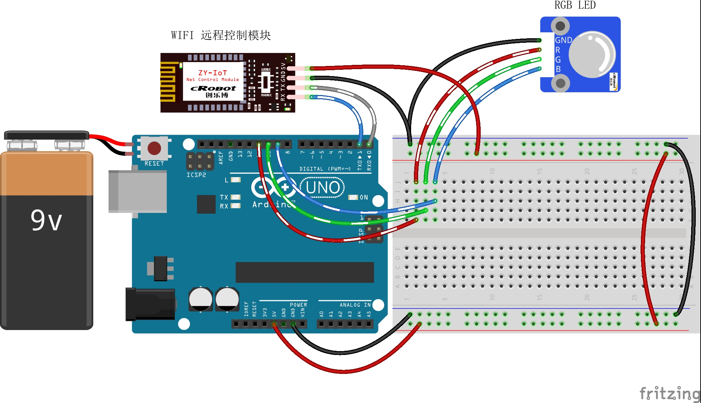

# 2-Remote-Control-RGB

远程控制 RGB彩灯

## 接线图



## 代码

```c
//定义引脚
int RED_LED_Pin = 11;    //红色LED
int GREEN_LED_Pin = 10;  //绿色LED
int BLUE_LED_Pin = 9;    //黄色LED

int incomingByte = 0;             // 接收到的 data byte
String inputString = "";          // 用来储存接收到的内容
boolean newLineReceived = false;  // 前一次数据结束标志
boolean startBit = false;         //协议开始标志

String returntemp = "";  //存储返回值
/**
* Function       setup
* @brief         初始化配置
*/
void setup() {
  //初始化LEDIO口为输出方式
  pinMode(RED_LED_Pin, OUTPUT);
  pinMode(GREEN_LED_Pin, OUTPUT);
  pinMode(BLUE_LED_Pin, OUTPUT);

  Serial.begin(9600);  //波特率9600 （Wifi通讯设定波特率）
                       //LED初始化低电平
  digitalWrite(RED_LED_Pin, LOW);
  digitalWrite(GREEN_LED_Pin, LOW);
  digitalWrite(BLUE_LED_Pin, LOW);
}
/**
* Function       loop
* @brief         按照接收的数据根据协议完成相应的功能 
*/
void loop() {
  //$RGB-R255-G125-B000^
  while (newLineReceived) {
    if (inputString.indexOf("RGB") == -1)  //如果要检索的字符串值“RGB”没有出现
    {
      returntemp = "$RGB-2,#";   //返回不匹配
      Serial.print(returntemp);  //返回协议数据包
      inputString = "";          // clear the string
      newLineReceived = false;
      break;
    }
    //红色解析
    int i = inputString.indexOf("R", 2);   //从接收到的数据中以2为起始位置检索字符串“R”的位置
    int ii = inputString.indexOf("-", i);  //从接收到的数据中以i为起始位置检索字符串“，”的位置
    if (ii > i && ii > 0 && i > 0)         //如果ii和i的顺序对了并且检索到ii与i存在
    {
      String sRedPWM = inputString.substring(i + 1, ii);  //提取字符串中介于指定下标i+1到ii之间的字符赋值给sRedPWM
      int iRedPWM = sRedPWM.toInt();                      //将字符串sRedPWM转为整型
      analogWrite(RED_LED_Pin, iRedPWM);
    } else  //检索到ii和i的顺序不对或者没有检索到ii或者i
    {
      returntemp = "$RGB-1,#";   //返回匹配失败
      Serial.print(returntemp);  //返回协议数据包
      inputString = "";          // clear the string
      newLineReceived = false;
      break;
    }
    //绿色解析
    i = inputString.indexOf("G", ii);  //从接收到的数据中以ii为起始位置检索字符串“G”的位置
    ii = inputString.indexOf("-", i);  //从接收到的数据中以i为起始位置检索字符串“，”的位置
    if (ii > i && ii > 0 && i > 0)     //如果ii和i的顺序对了并且检索到ii与i存在
    {
      String sGreenPWM = inputString.substring(i + 1, ii);  //提取字符串中介于指定下标i+1到ii之间的字符赋值给sGreenPWM
      int iGreenPWM = sGreenPWM.toInt();                    //将字符串sGreenPWM转为整型
      analogWrite(GREEN_LED_Pin, iGreenPWM);
    } else  //检索到ii和i的顺序不对或者没有检索到ii或者i
    {
      returntemp = "$RGB-1,#";   //返回匹配失败
      Serial.print(returntemp);  //返回协议数据包
      inputString = "";          // clear the string
      newLineReceived = false;
      break;
    }
    //蓝色解析
    i = inputString.indexOf("B", ii);  //从接收到的数据中以ii为起始位置检索字符串“B”的位置
    ii = inputString.indexOf("^", i);  //从接收到的数据中以i为起始位置检索字符串“#”的位置
    if (ii > i && ii > 0 && i > 0)     //如果ii和i的顺序对了并且检索到ii与i存在
    {
      String sBluePWM = inputString.substring(i + 1, ii);  //提取字符串中介于指定下标i+1到ii之间的字符赋值给sBluePWM
      int iBluePWM = sBluePWM.toInt();                     //将字符串sBluePWM转为整型
      analogWrite(BLUE_LED_Pin, iBluePWM);
    } else {
      returntemp = "$RGB-1,#";   //返回匹配失败
      Serial.print(returntemp);  //返回协议数据包
      inputString = "";          // clear the string
      newLineReceived = false;
      break;
    }


    // returntemp = "$RGB,0,#";    //返回匹配成功
    //  Serial.print(returntemp); //返回协议数据包
    inputString = "";  // clear the string
    newLineReceived = false;
  }
}
/**
* Function       serialEvent
* @brief         串口接收中断
*/
void serialEvent() {
  while (Serial.available())  //如果串口接收到数据则进入循环
  {
    incomingByte = Serial.read();  //一个字节一个字节地读，下一句是读到的放入字符串数组中组成一个完成的数据包
    if (incomingByte == '$')       //如果到来的字节是'$'，开始读取
    {
      startBit = true;
    }
    if (startBit == true) {
      inputString += (char)incomingByte;  // 全双工串口可以不用在下面加延时，半双工则要加的//
    }
    if (incomingByte == '^')  //如果到来的字节是'#'，读取结束
    {
      newLineReceived = true;
      startBit = false;
    }
  }
}

```