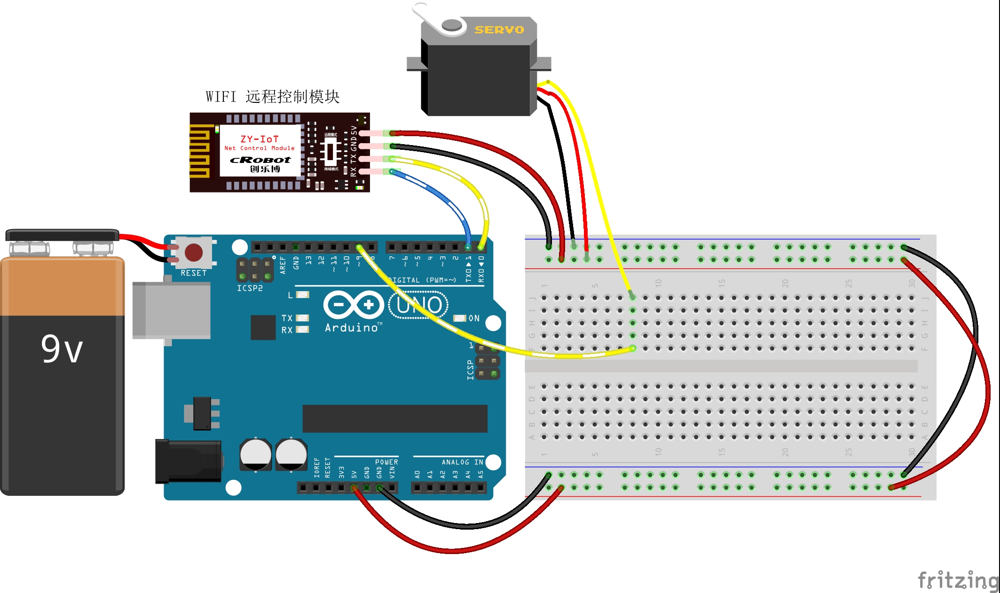

# 20-Remote-steering-gear-control

远程舵机控制

## 接线图



## 代码

```c
#include <Servo.h>  //Arduino IDE自带的舵机库文件

#define Servo_Pin      9                   // 舵机管脚

int incomingByte = 0;                    // 接收到的 data byte
String inputString = "";                 // 用来储存接收到的内容
boolean newLineReceived = false;         // 前一次数据结束标志
boolean startBit  = false;               //协议开始标志


String returntemp = "";           //存储返回值 

Servo myservo;      //定义舵机对象myservo

/*printf格式化字符串初始化*/
int serial_putc( char c, struct __file * )
{
  Serial.write( c );
  return c;
}
void printf_begin(void)
{
  fdevopen( &serial_putc, 0 );
}
/**
* Function       setup
* @brief         初始化配置
*/

void setup()
{
  Serial.begin(9600);	          //波特率9600 （WIFI通讯设定波特率）  
  printf_begin();
  //设置舵机控制引脚为3
  myservo.attach(Servo_Pin);

  //初始化舵机位置0
  myservo.write(0);
}
/**
* Function       loop
* @brief         按照接收的数据根据协议完成舵机转动的角度
*/
void loop() 
{   
   while (newLineReceived)
   {
      Serial.println(inputString);
       if(inputString.indexOf("SERVO") == -1)    //如果要检索的字符串值“SERVO”没有出现
       {
           returntemp = "$SERVO-2#";  //返回不匹配
           Serial.print(returntemp); //返回协议数据包       
           inputString = "";   // clear the string
           newLineReceived = false;
           break;    
       }
       //$SERVO-90^ 
       int i = inputString.indexOf("^",7);  //从接收到的数据中以7为起始位置检索字符串“#”的位置
       if(i > 0)        //如果检索到了
       {
         String temp = inputString.substring(7, i);  //提取字符串中介于指定下标7到i之间的字符赋值给temp
         int Pos = temp.toInt();                    //将字符串temp转为整型
         if(Pos >=0 && Pos <= 180)                 //如果收到的协议中舵机要转动的角度在0-180以内
         {
           myservo.write(Pos);                  //舵机转动相应角度
         }
         else
         {
            returntemp = "$SERVO-1#";  //返回匹配失败
            Serial.print(returntemp); //返回协议数据包       
            inputString = "";   // clear the string
            newLineReceived = false;
            break;    
         }
       }
       returntemp = "$SERVO-0#"; //返回匹配成功
       Serial.print(returntemp); //返回协议数据包       
       inputString = "";   // clear the string
       newLineReceived = false;  
   }   
}
/**
* Function       serialEvent
* @brief         串口接收中断
*/  
void serialEvent()
{
  while (Serial.available())                    //如果串口接收到数据则进入循环
  {    
    incomingByte = Serial.read();              //一个字节一个字节地读，下一句是读到的放入字符串数组中组成一个完成的数据包
    if(incomingByte == '$')                    //如果到来的字节是'$'，开始读取
    {
      startBit= true;
    }
    if(startBit == true)
    {
       inputString += (char) incomingByte;     // 全双工串口可以不用在下面加延时，半双工则要加的//
    }  
    if (incomingByte == '^')                 //如果到来的字节是'#'，读取结束
    {
       newLineReceived = true; 
       startBit = false;
    }
  }
}

```