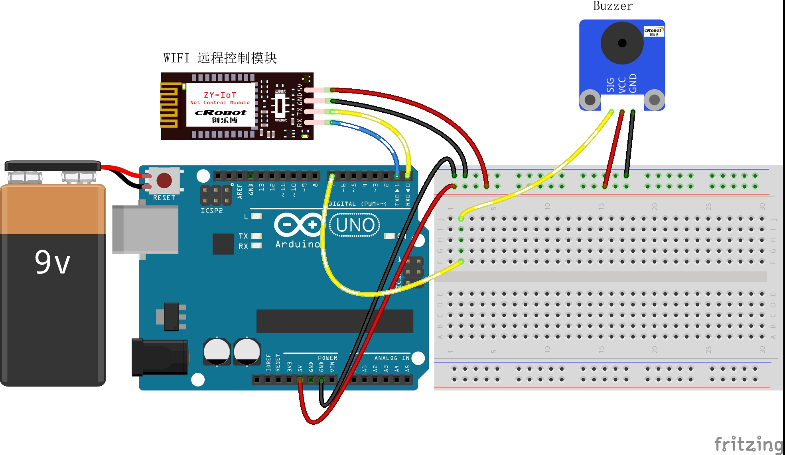

# 4-Remote-Control-Buzzer

远程控制 LED

## 接线图



## 代码

```c
//定义引脚，低电平-蜂鸣器响，高电平-蜂鸣器不响
int BEEP_Pin = 7;  //蜂鸣器

int incomingByte = 0;             // 接收到的 data byte
String inputString = "";          // 用来储存接收到的内容
boolean newLineReceived = false;  // 前一次数据结束标志
boolean startBit = false;         //协议开始标志


String returntemp = "";  //存储返回值

/**
* Function       setup
* @brief         初始化配置
*/
void setup() {
  //初始化蜂鸣器IO口为输出方式
  pinMode(BEEP_Pin, OUTPUT);

  Serial.begin(9600);  //波特率9600 （Wifi通讯设定波特率）

  //蜂鸣器初始化高电平 不叫
  digitalWrite(BEEP_Pin, HIGH);
}
/**
* Function       loop
* @brief         按照接收的数据根据协议完成相应的功能 
*/

void loop() {
  //协议格式：$BEEP-1^
  while (newLineReceived) {
    // 如果要检索的字符串值“BEEP”没有出现
    if (inputString.indexOf("BEEP") == -1)  
    {
      returntemp = "$BEEP-2,#";  //返回不匹配
      Serial.print(returntemp);  //返回协议数据包
      inputString = "";          // clear the string
      newLineReceived = false;
      break;
    }
    // 如果要检索的字符串值含有“BEEP”
    if (inputString[6] == '1')  //BEEP
    {
      int i = inputString.indexOf("-");      //从接收到的数据中检索字符串“,”出现的位置
      int ii = inputString.indexOf("^", i);  //从接收到的数据中以i为起始位置检索字符串“#”的位置
      if (ii > i && ii > 0 && i > 0)         //如果ii和i的顺序对了并且检索到ii与i存在
      {
        digitalWrite(BEEP_Pin, LOW);  //蜂鸣器响
      } else                          //检索到ii和i的顺序不对或者没有检索到ii或者i
      {
        returntemp = "$BEEP-1,#";  //返回匹配失败
        Serial.print(returntemp);  //返回协议数据包
        inputString = "";          // clear the string
        newLineReceived = false;
        break;
      }
    } else  //位置为第7位的字符串不为1
    {
      digitalWrite(BEEP_Pin, HIGH);  //蜂鸣器不响
    }

    //   returntemp = "$BEEP,0,#";    //返回匹配成功

    //   Serial.print(returntemp); //返回协议数据包
    inputString = "";  // clear the string
    newLineReceived = false;
  }
}
/**
* Function       serialEvent
* @brief         串口接收中断
*/
void serialEvent() {
  while (Serial.available())  //如果串口接收到数据则进入循环
  {
    incomingByte = Serial.read();  //一个字节一个字节地读，下一句是读到的放入字符串数组中组成一个完成的数据包
    if (incomingByte == '$')       //如果到来的字节是'$'，开始读取
    {
      startBit = true;
    }
    if (startBit == true) {
      inputString += (char)incomingByte;  // 全双工串口可以不用在下面加延时，半双工则要加的//
    }
    if (incomingByte == '^')  //如果到来的字节是'#'，读取结束
    {
      newLineReceived = true;
      startBit = false;
    }
  }
}

```