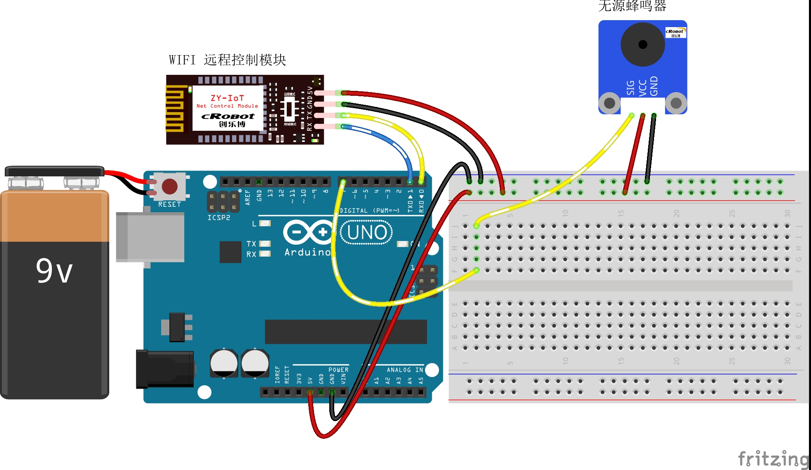

# 5-Remote-Control-Music

远程控制音乐播放

## 接线图



## 代码

主要代码如下：

```c
/**
* Function       setup
* @brief         初始化配置
*/
void setup() {
  pinMode(SPEAKER_Pin, OUTPUT);  //蜂鸣器初始化为输出模式
  pinMode(13, OUTPUT);

  Serial.begin(9600);  //波特率9600 （蓝牙通讯设定波特率）

  digitalWrite(SPEAKER_Pin, HIGH);
  MsTimer2::set(500, analysis);  // 中断设置函数，每 500ms 进入一次中断
  MsTimer2::start();             //开始计时
}

/**
* Function       loop
* @brief         按照接收的数据根据协议完成相应的功能 
*/
void loop() {
  //$MUSIC-4-1^
  switch (g_Music_now)  //解析协议后判断当前播放哪首歌曲
  {
    case 0: digitalWrite(SPEAKER_Pin, HIGH); break;  //蜂鸣器置高电平
    case 1:
      Play1();
      g_Music_now = 0;
      break;  //播放歌曲1，播放后蜂鸣器置高电平
    case 2:
      Play2();
      g_Music_now = 0;
      break;  //播放歌曲2，播放后蜂鸣器置高电平
    case 3:
      Play3();
      g_Music_now = 0;
      break;  //播放歌曲3，播放后蜂鸣器置高电平
    case 4:
      Play4();
      g_Music_now = 0;
      break;         //播放歌曲4，播放后蜂鸣器置高电平
    default: break;  //如果g_Music_now等于其他的值则停止
  }
}

/**
* Function       Play1
* @brief         播放歌曲1
*/

void Play1() {
  int length = sizeof(tune_1) / sizeof(tune_1[0]);  //计算长度
  for (int x = 0; x < length; x++) {
    serialEvent();                //调用串口读写
    if (newLineReceived == true)  //如果串口接收一个完整的数据包
    {
      analysis();  //协议解析
    }
    if (g_Music_now != 1)  //如果不播放歌曲1
    {
      return;  //返回主函数
    }
    tone(SPEAKER_Pin, tune_1[x]);
    delay(500 * durt_1[x]);  //这里用来根据节拍调节延时，500这个指数可以自己调整，在该音乐中，我发现用500比较合适。
    noTone(SPEAKER_Pin);
  }
}

/**
* Function       Play2
* @brief         播放歌曲2
*/

void Play2() {

  int length = sizeof(tune_2) / sizeof(tune_2[0]);  //计算长度
  for (int x = 0; x < length; x++) {
    serialEvent();                //调用串口读写
    if (newLineReceived == true)  //如果串口接收一个完整的数据包
    {
      analysis();  //协议解析
    }
    if (g_Music_now != 2)  //如果不播放歌曲2
    {
      return;  //返回主函数
    }
    tone(SPEAKER_Pin, tune_2[x]);
    delay(500 * durt_2[x]);  //这里用来根据节拍调节延时，500这个指数可以自己调整，在该音乐中，我发现用500比较合适。
    noTone(SPEAKER_Pin);
  }
}
/**
* Function       Play3
* @brief         播放歌曲3
*/
void Play3() {
  int length = sizeof(tune_3) / sizeof(tune_3[0]);  //计算长度
  for (int x = 0; x < length; x++) {
    serialEvent();                //调用串口读写
    if (newLineReceived == true)  //如果串口接收一个完整的数据包
    {
      analysis();  //协议解析
    }
    if (g_Music_now != 3)  //如果不播放歌曲3
    {
      return;  //返回主函数
    }
    tone(SPEAKER_Pin, tune_3[x]);
    delay(500 * durt_3[x]);  //这里用来根据节拍调节延时，500这个指数可以自己调整，在该音乐中，我发现用500比较合适。
    noTone(SPEAKER_Pin);
  }
}
/**
* Function       Play4
* @brief         播放歌曲4
*/
void Play4() {
  int length = sizeof(tune_4) / sizeof(tune_4[0]);  //计算长度
  for (int x = 0; x < length; x++) {
    serialEvent();                //调用串口读写
    if (newLineReceived == true)  //如果串口接收一个完整的数据包
    {
      analysis();  //协议解析
    }
    if (g_Music_now != 4)  //如果不播放歌曲4
    {
      return;  //返回主函数
    }
    tone(SPEAKER_Pin, tune_4[x]);
    delay(500 * durt_4[x]);  //这里用来根据节拍调节延时，500这个指数可以自己调整，在该音乐中，我发现用500比较合适。
    noTone(SPEAKER_Pin);
  }
}

/**
* Function       analysis
* @brief         协议分析
*/
void analysis() {
  digitalWrite(13, HIGH);  //板载LED灯亮
  while (newLineReceived)  //当串口接受完一个完整的数据包
  {
    if (inputString.indexOf("MUSIC") == -1)  //如果要检索的字符串值“MUSIC”没有出现
    {
      returntemp = "$MUSIC-2,#";  //返回不匹配
      Serial.print(returntemp);   //返回协议数据包
      inputString = "";           // clear the string
      newLineReceived = false;
      break;
    }

    //解析开关
    int i = inputString.indexOf("^", 0);  //从接收的数据中第0位开始检索"^"的位置
    if (i != -1)                          //如果检索到了
    {
      if (inputString[i - 1] == '1')  //如果"#"的前面一位字符串值为'1'
      {
        if (inputString[7] == '1')  //如果接收的数据第七位字符串值为1
        {
          int i = inputString.indexOf("-");      //从接收到的数据中检索“，”出现的位置
          int ii = inputString.indexOf("^", i);  //从接收到的数据中以i为起始位置检索字符串“#”的位置
          if (ii > i && ii > 0 && i > 0)         //如果ii和i的顺序对了并且检索到ii与i存在
          {
            g_Music_now = 1;
          }
        }
        if (inputString[7] == '2')  //如果接收的数据第七位字符串值为2
        {
          int i = inputString.indexOf("-");      //从接收到的数据中检索“，”出现的位置
          int ii = inputString.indexOf("^", i);  //从接收到的数据中以i为起始位置检索字符串“#”的位置
          if (ii > i && ii > 0 && i > 0)         //如果ii和i的顺序对了并且检索到ii与i存在
          {
            g_Music_now = 2;
          }
        }
        if (inputString[7] == '3')  //如果接收的数据第七位字符串值为3
        {
          int i = inputString.indexOf("-");      //从接收到的数据中检索“，”出现的位置
          int ii = inputString.indexOf("^", i);  //从接收到的数据中以i为起始位置检索字符串“#”的位置
          if (ii > i && ii > 0 && i > 0)         //如果ii和i的顺序对了并且检索到ii与i存在
          {
            g_Music_now = 3;
          }
        }
        if (inputString[7] == '4')  //如果接收的数据第七位字符串值为4
        {
          int i = inputString.indexOf("-");      //从接收到的数据中检索“，”出现的位置
          int ii = inputString.indexOf("^", i);  //从接收到的数据中以i为起始位置检索字符串“#”的位置
          if (ii > i && ii > 0 && i > 0)         //如果ii和i的顺序对了并且检索到ii与i存在
          {
            g_Music_now = 4;
          }
        }
      } else  //“#”的前面一位字符串值不为'1'
      {
        g_Music_now = 0;
      }
    }

    //returntemp = "$MUSIC,0,#"; //返回匹配成功

    //  Serial.print(returntemp); //返回协议数据包
    inputString = "";  // clear the string
    newLineReceived = false;
  }
  digitalWrite(13, LOW);  //板载LED灯灭
}
/**
* Function       serialEvent
* @brief         串口接收中断
*/
void serialEvent() {
  digitalWrite(13, HIGH);
  while (Serial.available())  //如果串口接收到数据则进入循环
  {
    incomingByte = Serial.read();  //一个字节一个字节地读，下一句是读到的放入字符串数组中组成一个完成的数据包
    if (incomingByte == '$')       //如果到来的字节是'$'，开始读取
    {
      startBit = true;
    }
    if (startBit == true) {
      inputString += (char)incomingByte;  // 全双工串口可以不用在下面加延时，半双工则要加的//
    }
    if (incomingByte == '^')  //如果到来的字节是'#'，读取结束
    {
      newLineReceived = true;
      startBit = false;
    }
  }
}

```