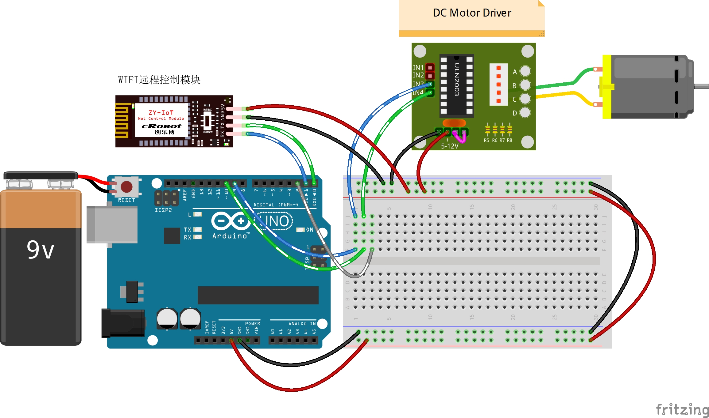

# 6-Remote-Control-Blower

远程控制 LED

## 接线图



## 代码

```c
//定义引脚
int Fan_Pin = 10;                 // 风扇PWM管脚
int incomingByte = 0;             // 接收到的 data byte
String inputString = "";          // 用来储存接收到的内容
boolean newLineReceived = false;  // 前一次数据结束标志
boolean startBit = false;         //协议开始标志
String returntemp = "";           //存储返回值

/**
* Function       setup
* @brief         初始化配置
*/
void setup() {
  pinMode(Fan_Pin, OUTPUT);  //初始化风扇IO口为输出方式
  Serial.begin(9600);        //波特率9600 （Wifi通讯设定波特率）
  //digitalWrite(Fan_Pin, HIGH);
}

/**
* Function       loop
* @brief         按照接收的数据根据协议完成相应的功能 
*/
void loop() {
  while (newLineReceived) {
    if (inputString.indexOf("FAN") == -1)  //如果要检索的字符串值“FAN”没有出现
    {
      returntemp = "$FAN-2,#";   //返回不匹配
      Serial.print(returntemp);  //返回协议数据包
      inputString = "";          // clear the string
      newLineReceived = false;   // 前一次数据结束标志
      break;
    }
    //解析开关
    int i = inputString.indexOf("^", 0);  //从接收的数据中第0位开始检索"^"的位置
    if (i != -1)                          //如果检索到了
    {
      if (inputString[i - 1] == '1')  //如果“^”的前面一位字符串值为'1'，风扇打开
      {
        int a = inputString.indexOf("V", 0);               //a为从第0位开始检索到的"V"的位置
        int b = inputString.indexOf("-", a);               //b为从第a位开始检索的","的位置
        String sFANPWM = inputString.substring(a + 1, b);  //提取字符串中介于指定下标a+1到b之间的字符赋值给sFANPWM
        int iFANPWM = sFANPWM.toInt();                     //将字符串sFANPWM转为整型
        int outputValue = map(iFANPWM, 0, 100, 90, 255);   //0-100 划分到0-255  90风扇才可以转，可以自己调整
        analogWrite(Fan_Pin, outputValue);                 //风扇转
      } else                                               //“^”的前面一位字符串值不为'1'，风扇关闭
      {
        analogWrite(Fan_Pin, 0);  //风扇关
        //digitalWrite(Fan_Pin, HIGH);
        //Serial.print("chahha"); //返回协议数据包
      }
    }

    // returntemp = "$FAN,0,#";   //返回匹配成功

    //  Serial.print(returntemp); //返回协议数据包
    inputString = "";  // clear the string
    newLineReceived = false;
  }
}

/**
* Function       serialEvent
* @brief         串口接收中断
*/
void serialEvent() {
  while (Serial.available())  //如果串口接收到数据则进入循环
  {
    incomingByte = Serial.read();  //一个字节一个字节地读，下一句是读到的放入字符串数组中组成一个完成的数据包
    if (incomingByte == '$')       //如果到来的字节是'$'，开始读取
    {
      startBit = true;
    }
    if (startBit == true) {
      inputString += (char)incomingByte;  // 全双工串口可以不用在下面加延时，半双工则要加的//
    }
    if (incomingByte == '^')  //如果到来的字节是'#'，读取结束
    {
      newLineReceived = true;
      startBit = false;
    }
  }
}

```