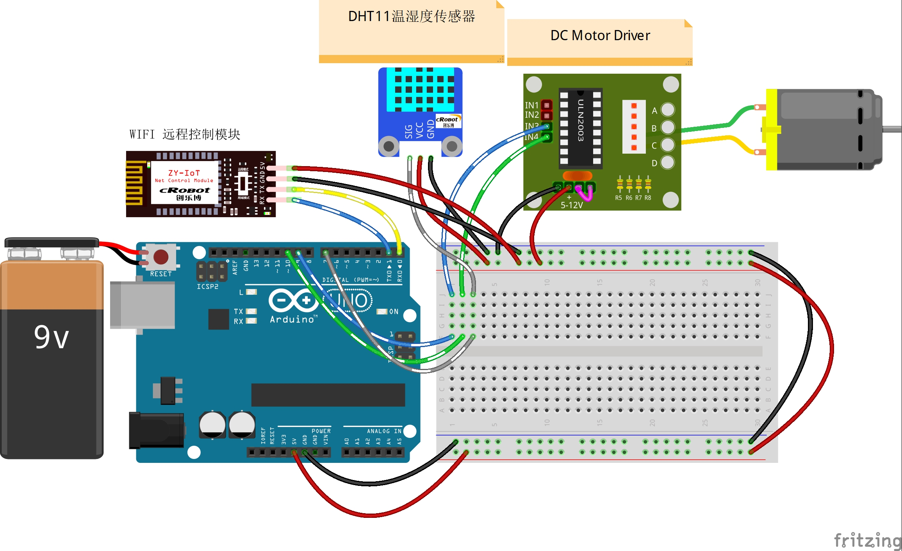

# Remote-Control-Temperature

远程控制 LED

## 接线图



## 代码

主要代码如下：

```c
#include "dht11.h"
#include <MsTimer2.h>  //定时器库的 头文件
dht11 DHT11;


#define Fan_Pin 10   // 风扇PWM管脚
#define DHT11_Pin 7  // 温湿度传感器管脚


int incomingByte = 0;             // 接收到的 data byte
String inputString = "";          // 用来储存接收到的内容
boolean newLineReceived = false;  // 前一次数据结束标志
boolean startBit = false;         //协议开始标志


String returntemp = "";                                    //存储返回值
float fTempCtr[5] = { 5.0f, 10.0f, 25.0f, 28.0f, 32.0f };  //存储温度阀值
const int iSpeedPwm[5] = { 0, 120, 160, 180, 200 };        //存储不同阀值对应不同速度
char temp[10] = { 0 };
float g_fTemp = 0.0;
unsigned int g_count = 10;

int GetTempToPWM(float v_fTemp) {
  /*小于2档以下都算是1档*/
  if (v_fTemp < fTempCtr[1])  //如果当前温度小于温度阈值20.0f
  {
    DisplaySpeed(1);                                               //风扇1档
    delay(1000);                                                   //延时1000ms
    return iSpeedPwm[0];                                           //返回速度0
  } else if ((v_fTemp >= fTempCtr[1]) && (v_fTemp < fTempCtr[2]))  //如果当前温度大于等于温度阈值20.0f且小于温度阈值25.0f
  {
    DisplaySpeed(2);                                               //风扇2档
    delay(1000);                                                   //延时1000ms
    return iSpeedPwm[1];                                           //返回速度120
  } else if ((v_fTemp >= fTempCtr[2]) && (v_fTemp < fTempCtr[3]))  //如果当前温度大于等于温度阈值25.0f且小于温度阈值28.0f
  {
    DisplaySpeed(3);                                               //风扇3档
    delay(1000);                                                   //延时1000ms
    return iSpeedPwm[2];                                           //返回速度160
  } else if ((v_fTemp >= fTempCtr[3]) && (v_fTemp < fTempCtr[4]))  //如果当前温度大于等于温度阈值28.0f且小于温度阈值32.0f
  {
    DisplaySpeed(4);                 //风扇4档
    delay(1000);                     //延时1000ms
    return iSpeedPwm[3];             //返回速度160
  } else if (v_fTemp > fTempCtr[4])  //如果当前温度大于等于温度阈值32.0f
  {
    DisplaySpeed(5);      //风扇5档
    delay(1000);          //延时1000ms
    return iSpeedPwm[4];  //返回速度255
  }
}

void DisplaySpeed(int v_iNum)  //板载LED显示当前档位
{
  for (int i = 0; i < v_iNum; i++)  //当前档位为多少，风扇就亮几次
  {
    digitalWrite(13, HIGH);
    delay(200);
    digitalWrite(13, LOW);
    delay(200);
  }
}
void UploadTemp() {

  memset(temp, 0x00, sizeof(temp));  //清空temp数组
  dtostrf(g_fTemp, 3, 1, temp);      // 相當於 %3.2f，将浮点数g_fTemp转化为整数部分长度为3小数部分为1数组变量名为temp的字符
  String sTemp = temp;               //数组temp中的字符串赋给sTemp
  String temp = "$AUTOFAN-V1-0-V2-0-V3-0-V4-0-V5-0-T" + sTemp + "#";
  Serial.print(temp);  //返回协议数据包
}
/**
* Function       setup
* @brief         初始化配置
*/

void setup() {
  //初始化温湿度传感器管脚、风扇、板载LEDIO口为输出方式
  pinMode(DHT11_Pin, OUTPUT);
  //pinMode(Fan_Pin, OUTPUT);
  pinMode(13, OUTPUT);
  Serial.begin(9600);               //波特率9600 （WIFI通讯设定波特率）
  MsTimer2::set(1000, UploadTemp);  // 中断设置函数，每 1000ms 进入一次中断
  MsTimer2::start();                //开始计时
}
/**
* Function       loop
* @brief         按照接收的数据根据协议完成相应的功能 
*/
void loop() {
  int chk = DHT11.read(DHT11_Pin);              //读取温湿度传感器管脚的数值
  g_fTemp = (float)DHT11.temperature;           //g_fTemp赋值为浮点型读取到的温度值
  analogWrite(Fan_Pin, GetTempToPWM(g_fTemp));  //根据现在温度输出不同PWM控制风扇转速

  // UploadTemp();

  while (newLineReceived) {
    if (inputString.indexOf("AUTOFAN") == -1)  //如果要检索的字符串值“AUTOFAN”没有出现
    {
      returntemp = "$AUTOFAN-2#";  //返回不匹配
      Serial.print(returntemp);    //返回协议数据包
      inputString = "";            // clear the string
      newLineReceived = false;     // 前一次数据结束
      break;
    }
    //解析开关
    // $AUTOFAN-V1-10-V2-14-V3-26-V4-29-V5-30-T20.2^
    //V1
    int i = inputString.indexOf("V1,", 0);     //从接收到的数据中从第0位开始检索字符串"V1,"出现的位置
    int ii = inputString.indexOf("-", i + 3);  //从接收到的数据中从第i + 3位开始检索字符串"-"出现的位置
    if (ii > i && i > 0 && ii > 0)             //如果ii和i的顺序对了并且检索到ii与i存在
    {
      String sV1 = inputString.substring(i + 3, ii);  //提取字符串中介于指定下标i+3到ii之间的字符赋值给sV1
      fTempCtr[0] = sV1.toFloat();                    //将sV1转化为浮点型赋值给fTempCtr[0]
    }
    //V2
    i = inputString.indexOf("V2,", ii);    //从接收到的数据中从第0位开始检索字符串"V2,"出现的位置
    ii = inputString.indexOf("-", i + 3);  //从接收到的数据中从第i + 3位开始检索字符串","出现的位置
    if (ii > i && i > 0 && ii > 0)         //如果ii和i的顺序对了并且检索到ii与i存在
    {
      String sV2 = inputString.substring(i + 3, ii);  //提取字符串中介于指定下标i+3到ii之间的字符赋值给sV2
      fTempCtr[1] = sV2.toFloat();                    //将sV2转化为浮点型赋值给fTempCtr[1]
    }
    //V3
    i = inputString.indexOf("V3,", ii);    //从接收到的数据中从第0位开始检索字符串"V3,"出现的位置
    ii = inputString.indexOf("-", i + 3);  //从接收到的数据中从第i + 3位开始检索字符串","出现的位置
    if (ii > i && i > 0 && ii > 0)         //如果ii和i的顺序对了并且检索到ii与i存在
    {
      String sV3 = inputString.substring(i + 3, ii);  //提取字符串中介于指定下标i+3到ii之间的字符赋值给sV3
      fTempCtr[2] = sV3.toFloat();                    //将sV3转化为浮点型赋值给fTempCtr[2]
    }
    //V4
    i = inputString.indexOf("V4,", ii);    //从接收到的数据中从第0位开始检索字符串"V4,"出现的位置
    ii = inputString.indexOf("-", i + 3);  //从接收到的数据中从第i + 3位开始检索字符串","出现的位置
    if (ii > i && i > 0 && ii > 0)         //如果ii和i的顺序对了并且检索到ii与i存在
    {
      String sV4 = inputString.substring(i + 3, ii);  //提取字符串中介于指定下标i+3到ii之间的字符赋值给sV4
      fTempCtr[3] = sV4.toFloat();                    //将sV4转化为浮点型赋值给fTempCtr[3]
    }
    //V5
    i = inputString.indexOf("V5,", ii);    //从接收到的数据中从第0位开始检索字符串"V5,"出现的位置
    ii = inputString.indexOf("-", i + 3);  //从接收到的数据中从第i + 3位开始检索字符串","出现的位置
    if (ii > i && i > 0 && ii > 0)         //如果ii和i的顺序对了并且检索到ii与i存在
    {
      String sV5 = inputString.substring(i + 3, ii);  //提取字符串中介于指定下标i+3到ii之间的字符赋值给sV4
      fTempCtr[4] = sV5.toFloat();                    //将sV5转化为浮点型赋值给fTempCtr[4]
    }


    memset(temp, 0x00, sizeof(temp));  //清空temp数组
    dtostrf(g_fTemp, 3, 1, temp);      // 相當於 %3.2f
    String sTemp = temp;               //数组temp中的字符串赋给sTemp

    //     returntemp ="$AUTOFAN-V1-0-V2-0-V3-0-V4-0-V5-0-T"+sTemp+"#";
    //      Serial.print(returntemp); //返回协议数据包
    inputString = "";  // clear the string
    newLineReceived = false;
    digitalWrite(13, HIGH);
  }
  delay(100);
}
/**
* Function       serialEvent
* @brief         串口接收中断
*/
void serialEvent() {
  while (Serial.available()) {
    incomingByte = Serial.read();  //一个字节一个字节地读，下一句是读到的放入字符串数组中组成一个完成的数据包
    if (incomingByte == '$')       //如果串口接收到数据则进入循环
    {
      startBit = true;  //如果到来的字节是'$'，开始读取
    }
    if (startBit == true) {
      inputString += (char)incomingByte;  // 全双工串口可以不用在下面加延时，半双工则要加的//
    }
    if (incomingByte == '^') {
      newLineReceived = true;  //如果到来的字节是'#'，读取结束
      startBit = false;
    }
  }
}
```