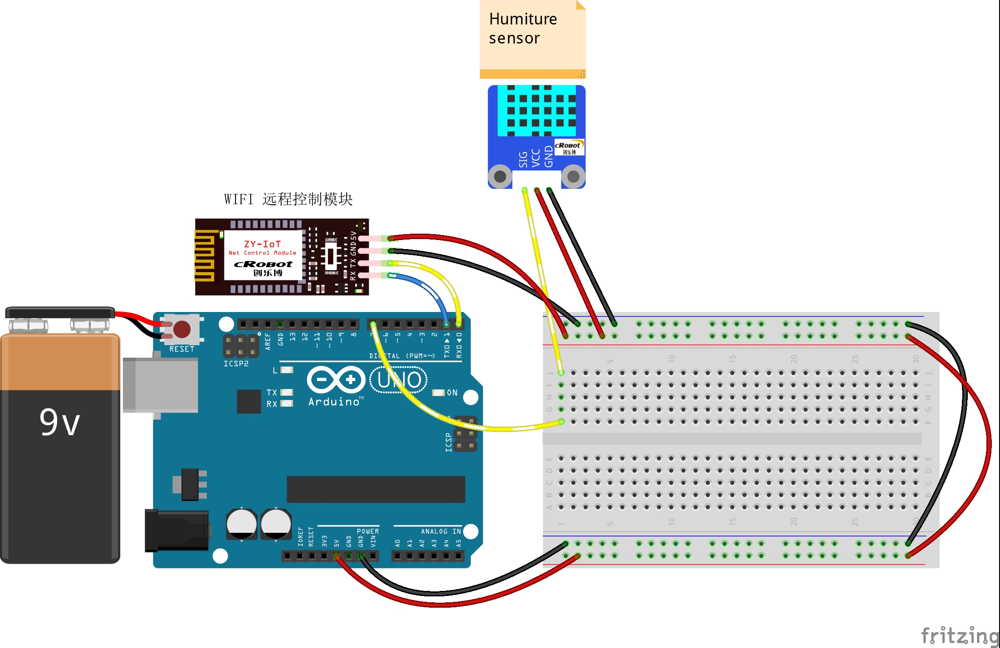

# 8-Remote-Control-temperature-and-humidity-Gathering

远程温湿度采集与曲线

## 接线图



## 代码

主要代码如下

```c
#include "dht11.h"
#include <MsTimer2.h>  //定时器库的 头文件
dht11 DHT11;


#define DHT11_Pin 7  // 温湿度传感器管脚


int incomingByte = 0;             // 接收到的 data byte
String inputString = "";          // 用来储存接收到的内容
boolean newLineReceived = false;  // 前一次数据结束标志
boolean startBit = false;         //协议开始标志

String returntemp = "";  //存储返回值
char temp[100] = { 0 };
/**
* Function       setup
* @brief         初始化配置
*/

void setup() {
  //初始化温湿度传感器管脚IO口为输出方式
  pinMode(DHT11_Pin, OUTPUT);
  Serial.begin(9600);  //波特率9600 （WIFI通讯设定波特率）
}
/**
* Function       loop
* @brief         按照接收的数据根据协议完成相应的功能 
*/
void loop() {

  while (1)  //newLineReceived)
  {
    int chk = DHT11.read(DHT11_Pin);       //读取温湿度传感器管脚的数值
    int fTemp = (float)DHT11.temperature;  //fTemp赋值为浮点型读取到的温度值
    int iHumidity = DHT11.humidity;        //iHumidity赋值为读取到的湿度值
                                           //       if(inputString.indexOf("TH") == -1)  //如果要检索的字符串值“TH”没有出现
                                           //       {
                                           //           returntemp = "$TH,2#";           //返回不匹配
                                           //           Serial.print(returntemp);            //返回协议数据包
                                           //           inputString = "";                     // clear the string
                                           //           newLineReceived = false;             // 前一次数据结束
                                           //           break;
                                           //       }
    //解析开关
    // $TH-1#

    memset(temp, 0x00, sizeof(temp));  //清空temp数组
    dtostrf(fTemp, 3, 1, temp);        // 相當於 %3.2f
    String sTemp = temp;               //数组temp中的字符串赋给sTemp
    String sHum = "";
    sHum += iHumidity;
    returntemp = "$TH-T" + sTemp + "-H" + sHum + "#";
    Serial.print(returntemp);  //返回协议数据包
    inputString = "";          // clear the string
    delay(3000);               ///延时3s
    //   newLineReceived = false;
  }
}

```