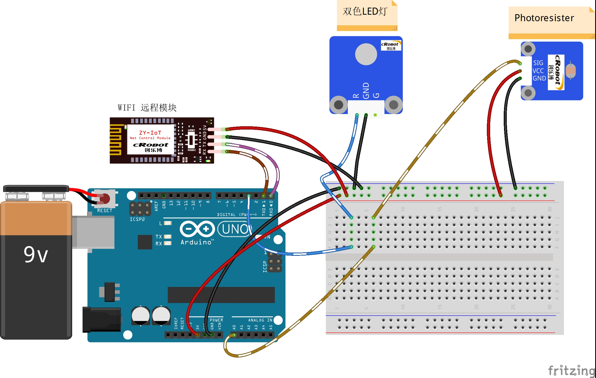

# 9-Remote-Light-sensitive-adjustment-of-LED-brightness

远程光敏调节LED亮度

## 接线图



## 代码

```c
#define GM_Pin A0  //光敏管脚，电压值：10000-0
#define LED_Pin 3  // LED管脚

int incomingByte = 0;             // 接收到的 data byte
String inputString = "";          // 用来储存接收到的内容
boolean newLineReceived = false;  // 前一次数据结束标志
boolean startBit = false;         //协议开始标志

String returntemp = "";  //存储返回值
int g_GM = 0;
int g_LT = 0;

/*printf格式化字符串初始化*/
int serial_putc(char c, struct __file*) {
  Serial.write(c);
  return c;
}
void printf_begin(void) {
  fdevopen(&serial_putc, 0);
}
/**
* Function       setup
* @brief         初始化配置
*/
void setup() {
  //pinMode(GM_Pin, INPUT_PULLUP);
  pinMode(LED_Pin, OUTPUT);  //初始化LED IO口为输出方式

  Serial.begin(9600);  //波特率9600 （WIFI通讯设定波特率）

  printf_begin();  //初始化printf
}
/**
* Function       loop
* @brief         根据光敏电阻读取到的数值控制LED调节不同光照灯的亮度
*/

void loop() {
  int val = analogRead(GM_Pin);  //读取A0口的电压值并赋值到val
  /* AD: x: 0~1024   Lux: y: 10000~0
   y = -(10000/1024) x + 10000;
   y = -9.76x + 10000; 约等于y = -10x+10000   */
  g_GM = -10 * val + 10000;
  g_LT = map(g_GM, 10000, 0, 0, 255);       //10000-0 划分到 0-255
  analogWrite(LED_Pin, 255 - g_LT);         //将划分好后的值模拟写入LED管脚
                                            // while (1)//newLineReceived)
                                            // {
                                            //       if(inputString.indexOf("LTCTR") == -1)    //如果要检索的字符串值“LTCTR”没有出现
                                            //       {
                                            //           returntemp = "$LTCTR-2,#";  //返回不匹配
                                            //           Serial.print(returntemp); //返回协议数据包
                                            //           inputString = "";   // clear the string
                                            //           newLineReceived = false; // 前一次数据结束标志
                                            //           break;
                                            //       }
  g_LT = map(g_LT, 0, 255, 100, 0);         //0-255 划分到 0-100
  printf("$LTCTR-LX%d-LT%d#", g_GM, g_LT);  //打印光强和亮度
  inputString = "";                         // clear the string
  delay(3000);
  //   newLineReceived = false;
  //   }
}
```